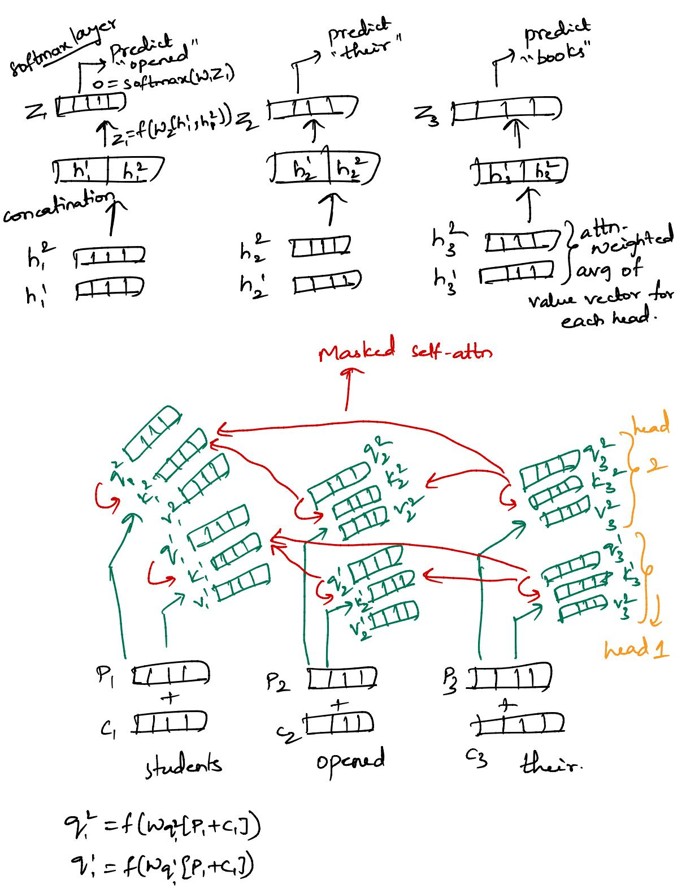
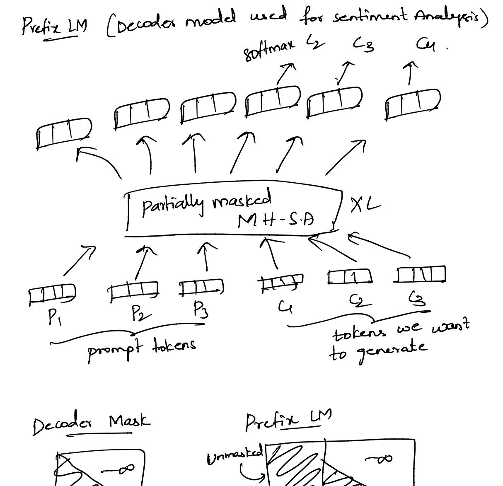
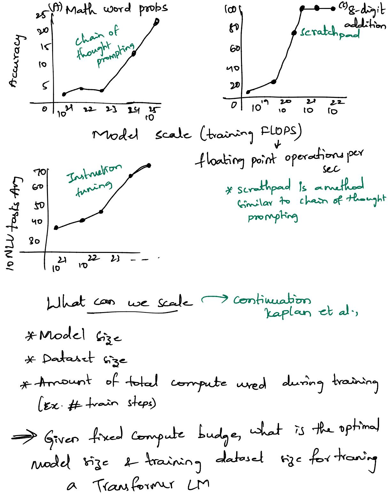
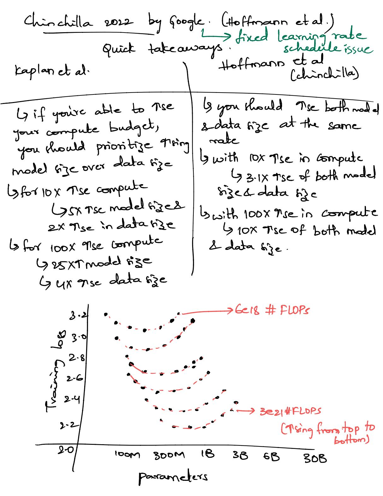
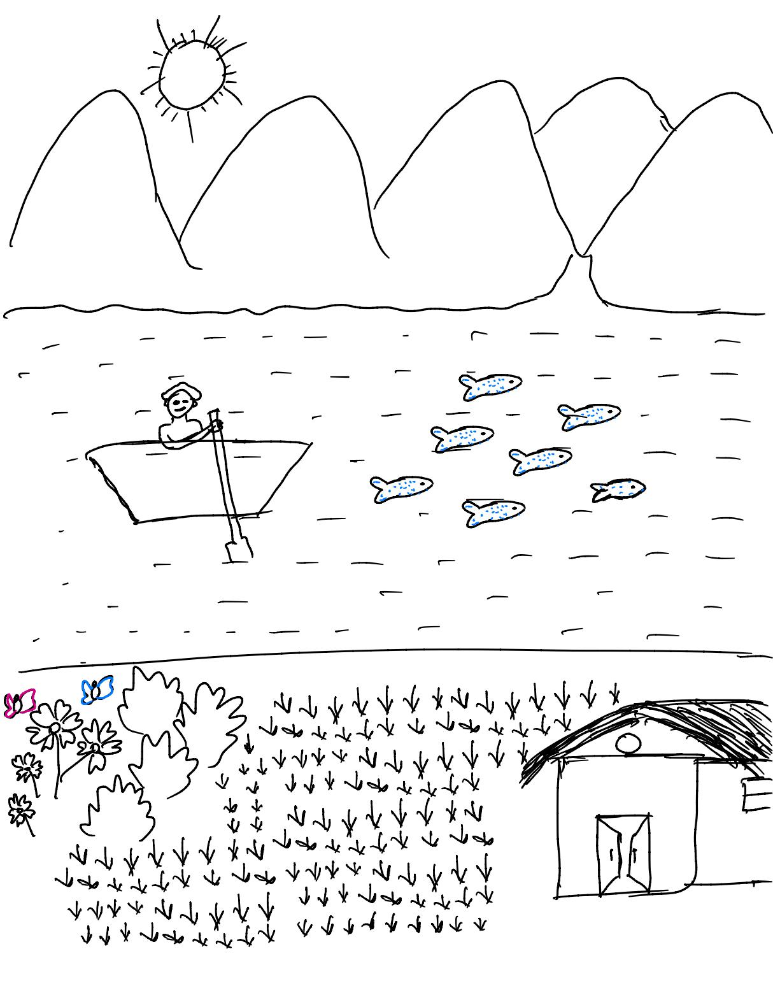
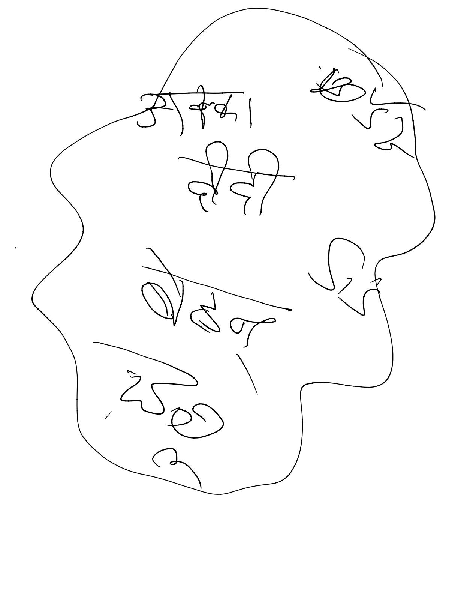
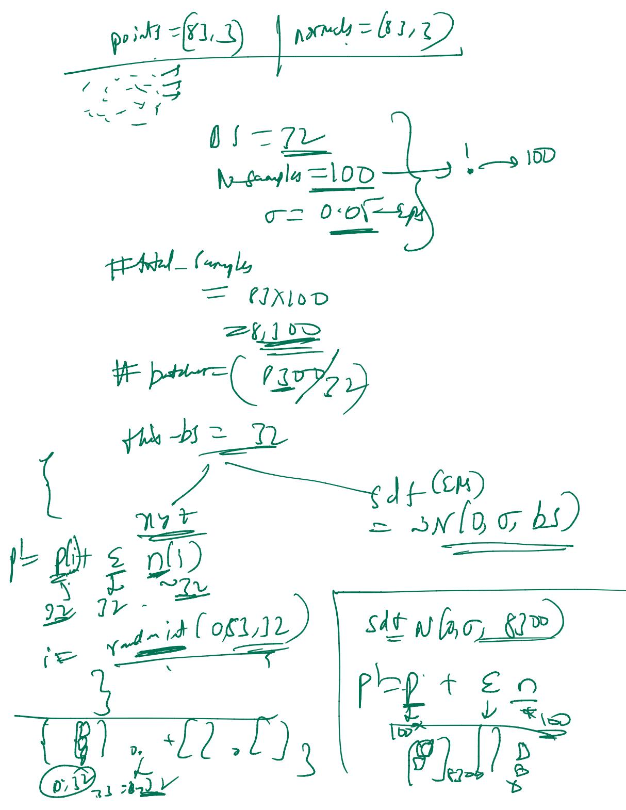

ADV NLP

Instruction turing! - training LLMs for specific task (LLMs) by giving the data in the form of instructions (IIP & O/P) transfer learning > use a pre-trained model for our task (1) self supervised pre-training)

Gue knowledges then fine tuning on specific tasks.

from pretrained \*context learning: - wing pre-trained model then prompting the problem text on um or um, Retrieval Augumented LLMs? -Grearch baring on -> then generate the factually query (google etc) correct output. N-gram models: P(Wn/w, wz, - w m) -> n-gram model bi-gram model -> P(W2/w1) tri-gram model -> P(W3/W1,W2) Unigram model -> P(W1W2 W3. -W3) TP(Wi) no prefix

usually big models uses n-gram with n-no more than 20. by forget text is I word most of the times. Is since having 2 can have many possible combinations. N-gram > n= prefix length + target word(1) Git is a data driven approach word type: - # unique words in vocabulary word token: # all words in vocabulary.

\* infini-gram -> dynamically choosing n.

\* apply one-hot encoding for all the words
\nin the training set for n-gram models

b) each word has a unique binary code

b) similar words also have diff codes.

b) memory intensive.

L) words that are not existing in the training maynot have any probability to occur.

ing maynot have any probability to occur.

\*\*Markor Assumption:
\*\*P(\omega\_1 | \omega\_1, \omega\_2, \omega\_3, \omega\_4, \omega\_5, \omega\_6) = P(\omega\_7 | \omega\_5, \omega\_6) = P(\omega\_7 | \omega\_5, \omega\_6) = P(\omega\_7 | \omega\_5, \omega\_6) = P(\omega\_7 | \omega\_5, \omega\_6) = P(\omega\_7 | \omega\_5, \omega\_6) = P(\omega\_7 | \omega\_5, \omega\_6) = P(\omega\_7 | \omega\_5, \omega\_6) = P(\omega\_7 | \omega\_5, \omega\_6) = P(\omega\_7 | \omega\_5, \omega\_6) = P(\omega\_7 | \omega\_5, \omega\_6) = P(\omega\_7 | \omega\_5, \omega\_6) = P(\omega\_7 | \omega\_5, \omega\_6) = P(\omega\_7 | \omega\_5, \omega\_6) = P(\omega\_7 | \omega\_5, \omega\_6) = P(\omega\_7 | \omega\_5, \omega\_6) = P(\omega\_7 | \omega\_5, \omega\_6) = P(\omega\_7 | \omega\_5, \omega\_6) = P(\omega\_7 | \omega\_5, \omega\_6) = P(\omega\_7 | \omega\_5, \omega\_6) = P(\omega\_7 | \omega\_5, \omega\_6) = P(\omega\_7 | \omega\_5, \omega\_6) = P(\omega\_7 | \omega\_5, \omega\_6) = P(\omega\_7 | \omega\_5, \omega\_6) = P(\omega\_7 | \omega\_5, \omega\_6) = P(\omega\_7 | \omega\_5, \omega\_6) = P(\omega\_7 | \omega\_5, \omega\_6) = P(\omega\_7 | \omega\_5, \omega\_6) = P(\omega\_7 | \omega\_5, \omega\_6) = P(\omega\_7 | \omega\_5, \omega\_6) = P(\omega\_7 | \omega\_5, \omega\_6) = P(\omega\_7 | \omega\_5, \omega\_6) = P(\omega\_7 | \omega\_5, \omega\_6) = P(\omega\_7 | \omega\_5, \omega\_6) = P(\omega\_7 | \omega\_5, \omega\_6) = P(\omega\_7 | \omega\_5, \omega\_6) = P(\omega\_7 | \omega\_5, \omega\_6) = P(\omega\_7 | \omega\_7 | \omega\_6) = P(\omega\_7 | \omega\_7 | \omega\_7 | \omega\_7 | \omega\_7 | \omega\_7 | \omega\_7 | \omega\_7 | \omega\_7 | \omega\_7 | \omega\_7 | \omega\_7 | \omega\_7 | \omega\_7 | \omega\_7 | \omega\_7 | \omega\_7 | \omega\_7 | \omega\_7 | \omega\_7 | \omega\_7 | \omega\_7 | \omega\_7 | \omega\_7 | \omega\_7 | \omega\_7 | \omega\_7 | \omega\_7 | \omega\_7 | \omega\_7 | \omega\_7 | \omega\_7 | \omega\_7 | \omega\_7 | \omega\_7 | \omega\_7 | \omega\_7 | \omega\_7 | \omega\_7 | \omega\_7 | \omega\_7 | \omega\_7 | \omega\_7 | \omega\_7 | \omega\_7 | \omega\_7 | \omega\_7 | \omega\_7 | \omega\_7 | \omega\_7 | \omega\_7 | \omega\_7 | \omega\_7 | \omega\_7 | \omega\_7 |

intuition? - better model arrights higher probability to the word that actually occurs (brose) is the next word. Is if the model has equal pools for all the words as next word - high perplexity & it is confused.

1ct-3 ple storage o (exp(n)) exp combinations possible Problems with n-gram. 2) by all words are treated independently.

4 semantically similar words are not used for predicting nutword 3) by sparrity (zero probable words / non existing appropriate next words)

4 not explainable they just rely on the count n-grams are represented in one-hot vectors (bag of words) G. problems! - even though words are similar the vectors are diff (dot products are zero) Due reed the representation which are similar for similar words and are not very large to compute & also address sparsity problem. Neural Networks

(a) Representation of the words => embeddings.

Since the rize is lower than one not rep

Ly but this mentional vectors) by but this representation does not have any interretability for each of its value. 4 dimension is known by trying on diff and finding and the best suit

weight matrix -> contains params updates during learning process. Ly projects the ip vector into the old vector dimension. X->1/p, H-> weight matrix. apply

(Wx) > projected vector in the dimension of opp

apply

(oftmax function. Experted final linear layer (O/P)

(numbers (logits) of rize V

softmax (x) = ex = off is the probability of

corresponding word to occur

next. >> Input sequence composition functions y sum up embeddings of all the words in the sequence. Text: positional sequence. The token embedding Georgatinate all the embeddings in order into a single vector. =) in the hidden layers (hidden states from States from RelV activation for multiplication of head) felv (x) = mark (0,x) (hidden layer)

Grontinear function

A populated softmax at last the params.

Other Activation functions; ReW: - f(x) = max(0,x) [Rectified linear Unit]
Granues dead neurons (gradients can become 0\nif the input for a neuron is always re) Gleaky ReW: - f(x) = max(xx,x) Granetric ReLU (PReU): - f(re) = max(xx,x)
Where 'x' is learned during training. Gell (Gaussian error linear Unit]:-flx)= x. \$(x) \$(x) → cumulative pools of that value - This gaussian dist represents the standard "grading curve" - It barically regulates the ip value baring on probability. - If x is large > high prob for the info to be kept if x is low > low 11 " - It makes the gradient to be "smooth" & "curved! - used in transformers, models like BERT, GPT etc. by Sigmoid linear Unit (SiLU): - f(x)= 1+e-px

Simple feed forward layer (MLP):--step1: Weight Initialization (Xavier/ Kaiming) - Step 20 - Neural Network (forward pars) layer 1: ilp x layer 2: a) multiplied with weight & added bias ? (Linear layer) Z'= N'. x. +b'
batch = b) Normalization z'= z'-4 c) Activation function (GeW/tanh etc) hidde d) dropout (if applied) > p (arg) multiple hidden layers layer no output layer a) Linear layer capply weights & bias (2 = w.x + b") b) final activation (softman, linear (just weight)

(eel ) if the old)

Clausification regression. - step 3:- Loss calculation: measures gap blum Y: 2 ):
(Cross entropy or MSE) - Step 4:- Back propagation; - calculate gradients - Step 5: - optimizer: - takes those gradients & updates the weights Wnew = Wold - 1 20; - Step 6:- Repeat this process until boxs stops Shrinking.

#### 3. The Full Training Process (The Loop)

Now that we have layers, initialization, and an optimizer, here is how the "Machine" actually learns:

. . . . . . . . . . . . . . . . . . . .

### 1. Initialization: Weights are set using Kaiming (since we use GELU).

2. Forward Pass:

5. Optimizer Update:

- 1. Input  $\rightarrow$  Weight/Bias  $\rightarrow$  Norm  $\rightarrow$  **GELU**  $\rightarrow$  Dropout  $\rightarrow$  (Repeat for each layer).
  - 2. Result: A prediction *y*.
- Calculate Loss: A formula (like Mean Squared Error) measures the gap between the guess and the actual target.
- 4. Backpropagation (The Calculus):
  - 1. The network calculates the **Gradient** (the slope) for every single weight. This tells the network: "If I
  - increase this weight by a tiny bit, will the error go up or down?"
  - 1. The Optimizer (Adam) takes those gradients and updates the weights:

$$W_{new} = W_{old} - (\text{Learning Rate} \times \text{Gradient})$$

large), we have to start with the right weights. This is where Initialization comes in.

6. **Iterate:** Repeat this for thousands of examples (epochs) until the error stops shrinking.

To keep a deep neural network from "dying" (signal becoming zero) or "exploding" (signal becoming too

### 1. Weight Initialization: Xavier vs. Kaiming

The goal of initialization is to keep the **variance** of the signals constant across all layers. If the signal gets weaker every layer, the network stops learning.

### A. Xavier (Glorot) Initialization

- Best for: "Symmetric" activation functions like Sigmoid or Tanh.
- The Logic: It assumes the activation function is linear near zero. It picks weights from a distribution with
  a specific spread.
- · The Math:

$$W \approx \text{Normal}\left(0, \frac{2}{n_{in} + n_{out}}\right)$$

(Where  $n_{in}$  is the number of inputs and  $n_{out}$  is the number of outputs).

### B. Kaiming (He) Initialization

- Best for: Non-symmetric functions like ReLU or GELU.
- The Logic: Because ReLU/GELU kills off half the distribution (the negative side), the signal strength
  - drops by half in every layer. Kaiming initialization compensates by making the weights "twice as strong."
- The Math:

$$W \approx \text{Normal}\left(0, \frac{2}{n_{in}}\right)$$

Which one to choose?

If you use GELU (modern transformers), use Kaiming. If you are using old-school Sigmoid, use Xavier.


### 2. Dropout: The "Random Safety Net"

### What is it?

Dropout is a regularization technique where, during each training step, you randomly "ignore" or "turn off" a fraction of neurons in a layer.

### Why is it useful?

- 1. Prevents Overfitting: It stops neurons from becoming too "dependent" on each other (co-adaptation).
- 2. **Forces Redundancy:** The network is forced to learn multiple independent ways to represent the same data because it never knows which neurons will be available.
- 3. Ensemble Effect: It's like training thousands of slightly different small networks and averaging them.

### How is it applied (The Math)?

For a layer with output h, and a dropout probability p (e.g., 0.5):

- 1. **Generate a Mask:** Create a vector r of the same size as h, where each element is 1 with probability (1-p) and 0 with probability p.
- 2. Apply Mask:  $h_{dropped} = h \cdot r$
- 3. **Scaling (Training):** To keep the total sum of the signal the same, we scale the remaining outputs by  $\frac{1}{1-p}$

$$h_{final} = \frac{h \cdot r}{1 - p}$$

**Crucial Note:** Dropout is **only** used during training. During testing (inference), all neurons are turned back on to give the most accurate prediction possible.

# Weight matrix in each layer (hidden) is represented as

### 1. Understanding Tensor Sizes

A weight matrix Walways represents a combination of "Neurons In" and "Neurons Out."

- Weight Matrix (W): Shape is (Neurons Out, Neurons In).
- Input Vector (x): Shape is (Neurons In, 1).
- Result (z):  $W \cdot x$  results in a shape of (Neurons Out, 1).

**Example:** If you have **10 inputs** and want **20 hidden neurons**, your Weight Matrix is  $20 \times 10$ . It "transforms" the 10 numbers into 20 numbers.

### 2. Simple 2-Hidden Layer Code (PyTorch)

Here is how you define a 3-layer network (Input  $\rightarrow$  Hidden 1  $\rightarrow$  Hidden 2  $\rightarrow$  Output) using everything we discussed: **GELU, Kaiming Init, LayerNorm, and Dropout.** 

```
python
import torch
import torch.nn as nn
class SimpleNet(nn.Module):
       super().__init__()
       # Laver 1: Input to Hidden 1
       self.fc1 = nn.Linear(in_size, h1_size)
       self.ln1 = nn.LayerNorm(h1_size)
       self.act1 = nn.GELU()
       self.drop1 = nn.Dropout(p=0.2)
       # Layer 2: Hidden 1 to Hidden 2
       self.fc2 = nn.Linear(h1_size, h2_size)
       self.ln2 = nn.LayerNorm(h2_size)
       self.act2 = nn.GELU()
       self.drop2 = nn.Dropout(p=0.2)
       # Layer 3: Hidden 2 to Output (Regression example)
       self.out = nn.Linear(h2_size, out_size)
       for m in self.modules():
            if isinstance(m, nn.Linear):
               nn.init.kaiming_normal_(m.weight, nonlinearity='relu') # Use for GELU toc
               nn.init.constant (m.bias, 0)
       # Flow: Linear -> Norm -> Act -> Drop
       x = self.drop1(self.act1(self.ln1(self.fc1(x))))
       x = self.drop2(self.act2(self.ln2(self.fc2(x))))
       return self.out(x)
```

# Create the model: 10 inputs -> 64 neurons -> 32 neurons -> 1 output
model = SimpleNet(in\_size=10, h1\_size=64, h2\_size=32, out\_size=1)

> sample
code for a
2-hidden layered
NN.
see the flow
of elp to olp
along with
weight initialization.

|                                                                 |                                     |                                                | _                        |
|-----------------------------------------------------------------|-------------------------------------|------------------------------------------------|--------------------------|
| Argument Breakdown                                              |                                     |                                                | example                  |
| in_size : The number of features                                | s in your raw data (e.g., 784 for p | ixels).                                        | 7 - 1                    |
| <pre>h1_size / h2_size : The "Width" patterns.</pre>            | of your hidden layers. More neu     | urons = more capacity to learn complex         | recomple ilp flowin      |
| p=0.2 : The Dropout probability (                               | 20% of neurons will be zeroed o     | ut during training).                           | prev network             |
| nonlinearity='relu': In PyTorc<br>curves are very similar.      | h's Kaiming init, we use the reli   | setting for GELU because their                 | prev network with dimen. |
| ımmary of the Math Flow:                                        |                                     |                                                | hons,                    |
| <b>Input (</b> <i>x</i> <b>):</b> Size [10]                     |                                     |                                                |                          |
| <b>FC1 (<math>W_1</math>):</b> Size [ $64 \times 10$ ]. Dot pro | duct results in size [64].          |                                                |                          |
| <b>FC2</b> ( $W_2$ ): Size [32 × 64]. Dot pro                   | duct results in size [32].          |                                                |                          |
| Out ( $W_3$ ): Size [1 $\times$ 32]. Dot prod                   | uct results in size [1].            |                                                |                          |
|                                                                 | f a 3-Word Sequence                 | with <b>Embedding Dim = 512</b> and <b>8</b> H | leads.                   |
| Step                                                            | Shape (Dimensions)                  | What happened?                                 |                          |
| Input IDs                                                       | [3]                                 | [101, 452, 800] (3 tokens)                     |                          |
| Embedding                                                       | $[3 \times 512]$                    | Each token is now a 512-dim vector             |                          |
| Positional Encoding                                             | $[3 \times 512]$                    | We add "order" info (so it knows "I"           | is first).               |
| Split into Heads                                                | [8, 3, 64]                          | 8 heads, each seeing 3 tokens of 64            | 4 dims.                  |
| Self-Attention                                                  | $[3 \times 512]$                    | Heads finish and are glued back to             | gether.                  |
| Add & Norm                                                      | $[3 \times 512]$                    | Residual connection and LayerNorr              | n.                       |
| Feed-Forward                                                    | [3 × 512]                           | The GELU/Linear layers process the             | e context.               |
| End of Layer 1                                                  | [3 × 512]                           | Data is ready to enter <b>Layer 2</b> .        |                          |

\* The i/P is divided with #attention heads & passed into each, after processing & attn scores calculated-concatinated.

| 2) Ged forward network & partion-wise Multi layer (MLP) & stack of dense layers  (MLP) & stack of dense layers  (MLP) & stack of dense layers  (MLP) & stack of dense layers  (MLP) & stack of dense layers  (MLP) & stack of dense layers  (MLP) & stack of dense layers |
|---------------------------------------------------------------------------------------------------------------------------------------------------------------------------------------------------------------------------------------------------------------------------|
| Improvements using neural nets:-  Is no sparsity problem (similar type of words are  (till litely to occur)  Is model size is O(n) not o(exp(n)) > V (n-gram)  Symbolems:-  Swindow of prefix is small  Is Tsed window uses the w-dimension                               |
| C) we donot share weights across window.  Decument Alexand Aletworks: - (RNN)                                                                                                                                                                                             |
| hidden states  hidden states  The f(Wh h(t-1) + We(t) he is he had he ho initial hidden state  Who initial hidden state  Word embeddings  (C1.C21-1)  State  Carrier Ch - word  Carrier Ch - word                                                                         |

advantages G can process any length 9 model doern't 9se for longer ilp Gomemony of prev words are parsed Is weights are shared by all the time steps (words) disadvantages ) seq-to-seq - 1 embedding cannot store into of 1 sentence. Is positional importance for the more recent words. 6 difficult to access into from many steps back. \* by Recurrent computation is show -> sequential process 1) it is handled with LSTMs, gated Recourrent units
2 Attr based RNNs Febru Training Neural language models -> parameters (ex: W1, W2, -- C1, C2--) 6 they are randomly initialized band so initial probabilities are random. 6 during training process use try to maximize the likhihood of training data

Da books Joo h / h=f(W1[c1,c2,c3])  $a \square$ parameters: {10,,02,-4,c2,-} = 9 Steps to train NLM: i) define a loss function L(D) 4 tells us how had the model is in predicting the next word 19 smooth & differentiable 2) we compute the gradient of L w.r.t D. 5 it gives the direction of steepest ascent. 4 same dimentionality as 0. 30 = { 3L, 3L, --- 3C, 3C, --} G for each param ; in o, gradient tells how the I would change by the change of j' by small

3). Given the ob, we take a step in the direction of -ve gradient Office we try to minimize L'. Onew = Oold - 200 => 1 - learning rate. "step size" Dephinizer: - finds the minimal value of L(6) Early stopping G when test /val loss starts 7 y stop
to avoid overfitting training GAdam (more common à outperforms normal SGD) G Sophia (UMS) hyperparameters of gradient descent: - learning rate 1 - batch rize 6 how many training examples we use to estimate <u>al</u> before take a step. Glarger the batch the better the estimate of de but it becomes computationally expensive.

- Gradient Descent - 1 update whole dataset

- SGD (Stochastic Gradient descent) - 1 update 1 sample

- batch-SGD \_ 1 update, for each batch (Latch fize param)

Gepoch when all samples are seen once by the model.

| <ul> <li>3. AdaGrad (Adaptive Gradient Algorithm)</li> <li>The Improvement: It introduces individual learning rates for every single parameter.</li> <li>What it does: It keeps a running sum of the squares of all prior gradients. If a parameter has a large gradient (common features), it shrinks its learning rate. If it has a small gradient (rare features), it keeps a larger learning rate.</li> <li>Hyperparameters: <ul> <li>E: A tiny constant to avoid division by zero.</li> </ul> </li> <li>The Problem: The learning rate eventually shrinks to zero because the sum of squares only grows, causing the model to stop learning prematurely.</li> <li>4. RMSProp (Root Mean Square Propagation)</li> </ul> | •                                                         | •             |                      |           |          |         | U        |                       |    |
|-----------------------------------------------------------------------------------------------------------------------------------------------------------------------------------------------------------------------------------------------------------------------------------------------------------------------------------------------------------------------------------------------------------------------------------------------------------------------------------------------------------------------------------------------------------------------------------------------------------------------------------------------------------------------------------------------------------------------------|-----------------------------------------------------------|---------------|----------------------|-----------|----------|---------|----------|-----------------------|----|
| <ul> <li>3. AdaGrad (Adaptive Gradient Algorithm)</li> <li>The Improvement: It introduces individual learning rates for every single parameter.</li> <li>What it does: It keeps a running sum of the squares of all prior gradients. If a parameter has a large gradient (common features), it shrinks its learning rate. If it has a small gradient (rare features), it keeps a larger learning rate.</li> <li>Hyperparameters: <ul> <li>E: A tiny constant to avoid division by zero.</li> </ul> </li> <li>The Problem: The learning rate eventually shrinks to zero because the sum of squares only grows, causing the model to stop learning prematurely.</li> <li>4. RMSProp (Root Mean Square Propagation)</li> </ul> | 12:19 AM Fri Feb 20                                       |               |                      |           |          |         |          | <b>?</b> 56% <b>□</b> | n  |
| <ul> <li>The Improvement: It introduces individual learning rates for every single parameter.</li> <li>What it does: It keeps a running sum of the squares of all prior gradients. If a parameter has a large gradient (common features), it shrinks its learning rate. If it has a small gradient (rare features), it keeps a larger learning rate.</li> <li>Hyperparameters: <ul> <li>&amp; A tiny constant to avoid division by zero.</li> </ul> </li> <li>The Problem: The learning rate eventually shrinks to zero because the sum of squares only grows, causing the model to stop learning prematurely.</li> <li>4. RMSProp (Root Mean Square Propagation)</li> </ul>                                                | Al Mode ▼ All Short videos Images                         | Forums        | Shopping             | Videos    | News     | Web     | Books    | Maps                  | FI |
| <ul> <li>What it does: It keeps a running sum of the squares of all prior gradients. If a parameter has a large gradient (common features), it shrinks its learning rate. If it has a small gradient (rare features), it keeps a larger learning rate.</li> <li>Hyperparameters:         <ul> <li>e: A tiny constant to avoid division by zero.</li> </ul> </li> <li>The Problem: The learning rate eventually shrinks to zero because the sum of squares only grows, causing the model to stop learning prematurely.</li> <li>RMSProp (Root Mean Square Propagation)</li> </ul>                                                                                                                                            | 3. AdaGrad (Adaptive Gradient A                           | l<br>Algorith | m)                   |           |          |         |          |                       |    |
| gradient (common features), it shrinks its learning rate. If it has a small gradient (rare features), it keeps a larger learning rate.  Hyperparameters:  • £: A tiny constant to avoid division by zero.  The Problem: The learning rate eventually shrinks to zero because the sum of squares only grows, causing the model to stop learning prematurely.                                                                                                                                                                                                                                                                                                                                                                 | The Improvement: It introduces individu                   | al learning   | <b>g rates</b> for e | very sing | le paran | neter.  |          |                       |    |
| • Et A tiny constant to avoid division by zero.  • The Problem: The learning rate eventually shrinks to zero because the sum of squares only grows, causing the model to stop learning prematurely.  4. RMSProp (Root Mean Square Propagation)                                                                                                                                                                                                                                                                                                                                                                                                                                                                              | gradient (common features), it shrinks i                  |               |                      | •         |          |         |          | •                     | 5  |
| The Problem: The learning rate eventually shrinks to zero because the sum of squares only grows, causing the model to stop learning prematurely.  RMSProp (Root Mean Square Propagation)                                                                                                                                                                                                                                                                                                                                                                                                                                                                                                                                    | Hyperparameters:                                          |               |                      |           |          |         |          |                       |    |
| causing the model to stop learning prematurely.  4. RMSProp (Root Mean Square Propagation)                                                                                                                                                                                                                                                                                                                                                                                                                                                                                                                                                                                                                                  | $\circ$ $\epsilon$ : A tiny constant to avoid division by | zero.         |                      |           |          |         |          |                       |    |
|                                                                                                                                                                                                                                                                                                                                                                                                                                                                                                                                                                                                                                                                                                                             | · ·                                                       |               | s to zero bed        | ause the  | sum of   | squares | only gro | ows,                  |    |
|                                                                                                                                                                                                                                                                                                                                                                                                                                                                                                                                                                                                                                                                                                                             | 4. RMSProp (Root Mean Square                              | Propaga       | tion)                |           |          |         |          |                       |    |
| The Improvement: It "forgets" very old gradients so the learning rate doesn't drop to zero.                                                                                                                                                                                                                                                                                                                                                                                                                                                                                                                                                                                                                                 |                                                           |               |                      |           | 18 1     |         |          |                       |    |

### cares about the *recent* magnitude of gradients. • Hyperparameters:

Decay rate (ρ): Usually 0.9. Controls how quickly the "memory" of gradient scales fades.

• What it does: Instead of a simple sum like AdaGrad, it uses an Exponential Moving Average. It only

• The Problem: It lacks the "directional" smoothness of Momentum.

### 5. Adam (Adaptive Moment Estimation)

**The Improvement:** The "All-in-One." It combines **Momentum** (for direction) and **RMSProp** (for individual scaling).

- What it does: It tracks the "First Moment" (mean of gradients) and the "Second Moment" (variance/magnitude). It is the most robust general-purpose optimizer.
- Hyperparameters:
  - $\beta_1$ : Momentum decay (usually **0.9**).
  - β<sub>2</sub>: Scaling decay (usually 0.999).
  - η: Base learning rate.
- The Problem: It struggled with "Weight Decay" (L2 regularization), which led to the creation of

Ask anything

٠

| 6. AdamW (Adam with Weight Decay)                                                                                                                                                                                                          |                     |
|--------------------------------------------------------------------------------------------------------------------------------------------------------------------------------------------------------------------------------------------|---------------------|
| The Improvement: Decouples weight decay from the gradient update. This is the standard for almost all LLMs (GPT, Llama, etc.).                                                                                                             | 9                   |
| <ul> <li>What it does: In standard Adam, weight decay gets mixed into the moving averages, which mathematically distorts the regularization. AdamW applies the decay after the update, leading to much better generalization.</li> </ul>   | ( LLM's             |
| • Hyperparameters: Same as Adam + Weight Decay (λ).                                                                                                                                                                                        |                     |
| 7. Adafactor                                                                                                                                                                                                                               | )                   |
| The Improvement: Massive memory savings for giant models.                                                                                                                                                                                  |                     |
| <ul> <li>What it does: Adam stores two extra values for every parameter. For a 70B model, that's huge.</li> <li>Adafactor "factors" these matrices into smaller chunks, using significantly less VRAM.</li> </ul>                          |                     |
| Used in: Google's T5 and PaLM models.                                                                                                                                                                                                      |                     |
| Julight decay:  191. reduces overfitting (large weights ten memorize the training data) -> make model of 192- can handle the exploding gradients p a make the weights more smoothier. 19 ensures no lingle neuron (connection be dominant. | sensitive<br>noblem |
| Glore in 2-ways 1. 22-regularization penalty to loss function                                                                                                                                                                              |                     |
| 2. Weight decay applied directly to weight at                                                                                                                                                                                              | each                |
| N-decay coefficient. SGD - both are same.                                                                                                                                                                                                  |                     |
| A - decay coefficient.  Adam, Adaml, RMS Prop etc -> as 1'st gets complex & mixedup.                                                                                                                                                       | 2nd metho           |
| as 1'st gets complex & mixedup.                                                                                                                                                                                                            | d                   |

### 1. Penalty to the Loss Function ( $L_2$ Regularization)

In this method, we modify the **Loss Function** (L) by adding a penalty term that gets larger as the weights (w) get larger.

The Equation:

$$L_{total} = L_{original} + \frac{\lambda}{2} \sum w^2$$

- λ (Lambda): The weight decay coefficient (how much you want to punish large weights).
- The Logic: During training, the optimizer now tries to minimize both the error and the size of the weights.

### 2. Direct Decay to Weights (During Update)

In this method, we don't change the loss function. Instead, we slightly shrink the weights every time we update them. This is how it is implemented in optimizers like **AdamW**.

The Equation:

$$w_{new} = w_{old} - \alpha \left( \frac{\partial L}{\partial w} \right) - \lambda w_{old}$$

- α: The learning rate.
- $\frac{\partial L}{\partial w}$ : The gradient (direction to reduce error).
- $-\lambda w_{old}$ : The decay part. You are subtracting a small percentage of the weight from itself.

### Comparison in Short

| Method                 | Where it happens  | The "Action"                                                   |
|------------------------|-------------------|----------------------------------------------------------------|
| Loss Penalty ( $L_2$ ) | Before the update | Increases the "error" score if weights are too big.            |
| Direct Decay           | During the update | Multiplies the weight by a factor (like $0.99$ ) to shrink it. |

Important Note: For simple Stochastic Gradient Descent (SGD), these two methods are mathematically identical. However, for modern optimizers like Adam, they behave differently, which is why AdamW (Adam with Weight Decay) was created to use the Direct Decay method for better results.

- Height decay applied to following weights:
  1. Wa, Wk, WV in transformers (self-attn layers)
- 2. feed forward Network: The expansion or contraction on layers (model's KB)
  - 3. very rarely to word embeddings.

loss function: - cross-entropy loss Ex: - goal: max p ("books" | "students opened their") : minimize tog p (books)...) 2=- log (P(books | prefix)) why cooss entropy bis:-9 distance measure between two distribution. = - & P(w) log p(w)

wer ( predicted data.

pusher books

o when its not books. Back propagation: 4) algo to compute of in a efficient manner. ilp Frain data (x,4) ilp targety. paraons: fw,, with gradient fall, bu, 1922

1. compute loss 2 2 square loss 122 loss
Tegression problems 2= 1/2 (4-0)2 40/p or predy 2: compute dL dw, dL dwz

intermediate variables,

d tanh (x)= 1-tanh2(x)

a= with

トニい、ス

chain rule of calculus
$$\frac{d}{dx}g(f(x)) = \frac{dg}{df} \cdot \frac{df}{dx}$$

$$\frac{d}{dx}g(f(x)) = \frac{dg}{df} \cdot \frac{df}{dx}$$

$$L = \frac{1}{2}(Y-D)^{2}$$

$$0 = \tanh(\omega_2 \cdot h)$$

$$\frac{dL}{d\omega_2} = \frac{dL}{do} \cdot \frac{dO}{da} \cdot \frac{da}{d\omega_2}$$

$$\frac{1}{\sqrt{2}} = \frac{dL}{d0} \cdot \frac{d0}{d0} \cdot \frac{da}{dw_{2}}$$

$$-(y-0) \cdot (1-0^{2}) \cdot h$$

= -(y-0). (1-02). W2. (1-h2).x b=wi.x backpropagation: caching prev computed derivatives

3. update params W2 new = W2 old - Mall W, new = W, old 7 dl, rides on how to calculate gradined linear layer.
Geomplications wring Pytorch. 21/02 RNN. In practice holling softman

holy him when he with Tre Tree Tree 1111 III III Judents opened their. -> Instead of applying fortman at last time step we apply softmax at each time step for it to be more effecient. L3 = - log P(books) Huden's opened their) L2 = - log P (thir | students opened)

Ly = -log (P(opened (students)) overall loss  $L = \frac{L_1 + L_2 + L_3}{3}$  | any we log likelihood forward forward forward in a sequence ) "Bottleneck" -> ho rector is ealely responsible for Jesues with RNN:predicting the next word -Ran Moorey; 2014

"you can't represent meaning of a sentence in a Bleeping Vector". 2) lack of parallelism across timesteps by his can be computed only after his To overcome the concept of Bottleneck "Attention" mechanism > can be parallelized during training. Gwere created first for RNNs & for machine (seg-to-seg) - vasmani et al . 2017 dropped recurrent & introduced fully attention based architecture. L'Transformer" Named Uin-troduced by google.

Self Attention: < 22: Softman vector (0.3,0.5,0.2>. h3=0.38, +0.582+0.283 percent values
percents as weights for
phidden layer. 1111 -> softmax
predict "books". Softmax of below rector attention sures <93, K1, 95, K2, 73, K5> a, III) Re III) 92/III) PV, THE PV2 THE PV3 THE PV3 THE PV3 THE PV3 THE PV3 THE PV3 THE PV3 THE PV3 THE PV3 THE PV3 THE PV3 THE PV3 THE PV3 THE PV3 THE PV3 THE PV3 THE PV3 THE PV3 THE PV3 THE PV3 THE PV3 THE PV3 THE PV3 THE PV3 THE PV3 THE PV3 THE PV3 THE PV3 THE PV3 THE PV3 THE PV3 THE PV3 THE PV3 THE PV3 THE PV3 THE PV3 THE PV3 THE PV3 THE PV3 THE PV3 THE PV3 THE PV3 THE PV3 THE PV3 THE PV3 THE PV3 THE PV3 THE PV3 THE PV3 THE PV3 THE PV3 THE PV3 THE PV3 THE PV3 THE PV3 THE PV3 THE PV3 THE PV3 THE PV3 THE PV3 THE PV3 THE PV3 THE PV3 THE PV3 THE PV3 THE PV3 THE PV3 THE PV3 THE PV3 THE PV3 THE PV3 THE PV3 THE PV3 THE PV3 THE PV3 THE PV3 THE PV3 THE PV3 THE PV3 THE PV3 THE PV3 THE PV3 THE PV3 THE PV3 THE PV3 THE PV3 THE PV3 THE PV3 THE PV3 THE PV3 THE PV3 THE PV3 THE PV3 THE PV3 THE PV3 THE PV3 THE PV3 THE PV3 THE PV3 THE PV3 THE PV3 THE PV3 THE PV3 THE PV3 THE PV3 THE PV3 THE PV3 THE PV3 THE PV3 THE PV3 THE PV3 THE PV3 THE PV3 THE PV3 THE PV3 THE PV3 THE PV3 THE PV3 THE PV3 THE PV3 THE PV3 THE PV3 THE PV3 THE PV3 THE PV3 THE PV3 THE PV3 THE PV3 THE PV3 THE PV3 THE PV3 THE PV3 THE PV3 THE PV3 THE PV3 THE PV3 THE PV3 THE PV3 THE PV3 THE PV3 THE PV3 THE PV3 THE PV3 THE PV3 THE PV3 THE PV3 THE PV3 THE PV3 THE PV3 THE PV3 THE PV3 THE PV3 THE PV3 THE PV3 THE PV3 THE PV3 THE PV3 THE PV3 THE PV3 THE PV3 THE PV3 THE PV3 THE PV3 THE PV3 THE PV3 THE PV3 THE PV3 THE PV3 THE PV3 THE PV3 THE PV3 THE PV3 THE PV3 THE PV3 THE PV3 THE PV3 THE PV3 THE PV3 THE PV3 THE PV3 THE PV3 THE PV3 THE PV3 THE PV3 THE PV3 THE PV3 THE PV3 THE PV3 THE PV3 THE PV3 THE PV3 THE PV3 THE PV3 THE PV3 THE PV3 THE PV3 THE PV3 THE PV3 THE PV3 THE PV3 THE PV3 THE PV3 THE PV3 THE PV3 THE PV3 THE PV3 THE PV3 THE PV3 THE PV3 THE PV3 THE PV3 THE PV3 THE PV3 THE PV3 THE PV3 THE PV3 THE PV3 THE PV3 THE PV3 THE PV3 THE PV3 THE PV3 THE PV3 THE PV3 THE PV3 THE PV3 THE PV3 THE PV3 THE PV3 THE PV3 THE PV3 THE PV3 THE PV3 THE PV3 THE PV3 THE PV3 THE PV3 THE PV3 THE PV3 THE PV3 THE PV3 THE PV3 THE PV3 THE PV3 THE PV3 THE PV3 THE PV3 THE PV3 THE PV3 THE PV3 THE PV3 THE PV3 THE PV3 THE PV3 TH + C2 opened + third TII)
P2
P2
P3 + Students positional. ] embeddings Pr Gethy are also model params be limitations on the # Positional embeddings (learn 100 pls for 100 len seq") y instead we could find a deterministic to that connects position iny! 9 = f(WaG)? query! q = f(WqG) } used to compute "attention"

Key: K = f(WpG) } score in predicting the next word. value: v, = f(W, G) } used to compute information tor the hidden state.

computation at second time step:  $h_2 = 0.3 V_1 + 0.7 V_2 + 0. V_3$ atto scores: L92K, , 92Ke7 >) No dependencies between hi, h2, h3. e) can be parallelized.

How to parallelize: atto vectors a, = <9,: k> 9<sub>2111</sub> k<sub>2</sub> 1111 a2 =< 9: K1, 72. K2> ag = <9, k, , 9, k2> 93 Th 9. X X X X X X X X X X X X X X X X X X X softmax (2) 1 1 1 1 1 1 1 1 1 1 1 1 1 1 1 1 1 1 1 2 1 X V2 1 2 h2 h3 Altention (Q, K, V) = softmax (QKT) V where Q, K, V are Queies, Keys and values packed together as a matrix.

To interpret Query, key & Value Ex. - if we are searthing something in google. the text we typed is "Query", the result appeared as a little of an article is "key" and content i wide article is "value". G so as to find best matched result we find the corine circularity between Query & key. > positional Encoding is important because in selfattention mechanism we doesn't take the ilp sequentially but we process it parallely, & embedded values document store the position. al information of the words in sequence. Softmax Softmax Scale Attention - MadMul Query Thinear Linear Value

| of Attention filter enables us to remove unnecessary information & focuses on the useful info.                                                                                                                                                                                                                                                                                                                                                                                                                                                                                                                                                                                                                                                                                                                                                                                                                                                                                                                                                                                                                                                                                                                                                                                                                                                                                                                                                                                                                                                                                                                                                                                                                                                                                                                                                                                                                                                                                                                                                                                                                                |
|-------------------------------------------------------------------------------------------------------------------------------------------------------------------------------------------------------------------------------------------------------------------------------------------------------------------------------------------------------------------------------------------------------------------------------------------------------------------------------------------------------------------------------------------------------------------------------------------------------------------------------------------------------------------------------------------------------------------------------------------------------------------------------------------------------------------------------------------------------------------------------------------------------------------------------------------------------------------------------------------------------------------------------------------------------------------------------------------------------------------------------------------------------------------------------------------------------------------------------------------------------------------------------------------------------------------------------------------------------------------------------------------------------------------------------------------------------------------------------------------------------------------------------------------------------------------------------------------------------------------------------------------------------------------------------------------------------------------------------------------------------------------------------------------------------------------------------------------------------------------------------------------------------------------------------------------------------------------------------------------------------------------------------------------------------------------------------------------------------------------------------|
|                                                                                                                                                                                                                                                                                                                                                                                                                                                                                                                                                                                                                                                                                                                                                                                                                                                                                                                                                                                                                                                                                                                                                                                                                                                                                                                                                                                                                                                                                                                                                                                                                                                                                                                                                                                                                                                                                                                                                                                                                                                                                                                               |
| •                                                                                                                                                                                                                                                                                                                                                                                                                                                                                                                                                                                                                                                                                                                                                                                                                                                                                                                                                                                                                                                                                                                                                                                                                                                                                                                                                                                                                                                                                                                                                                                                                                                                                                                                                                                                                                                                                                                                                                                                                                                                                                                             |
| Self-attention!—  Is train time: parallelizable  Les test time: Sequential.  train time  The can parallelize during training because we coftmax.  throw the complete sequence.  test time  (s my dog —! softmax(<21/2, 92/2>) sweighted avg  lethis happens for every word to its sequential.                                                                                                                                                                                                                                                                                                                                                                                                                                                                                                                                                                                                                                                                                                                                                                                                                                                                                                                                                                                                                                                                                                                                                                                                                                                                                                                                                                                                                                                                                                                                                                                                                                                                                                                                                                                                                                 |
| Decoding the word:  Gelect a word from the pred dist  Gelect a word from the pred dist  Gelect a word from the pred dist  Gelect a word from the pred dist  Gelect a word from the pred dist  Gelect a word:  Gelect a word:  Gelect a word:  Gelect a word:  Gelect a word:  Gelect a word:  Gelect a word:  Gelect a word:  Gelect a word:  Gelect a word from the pred dist  Gelect a word from the pred dist  Gelect a word:  Gelect a word:  Gelect a word from the pred dist  Gelect a word from the pred dist  Gelect a word from the pred dist  Gelect a word from the pred dist  Gelect a word from the pred dist  Gelect a word from the pred dist  Gelect a word from the pred dist  Gelect a word from the pred dist  Gelect a word from the pred dist  Gelect a word from the pred dist  Gelect a word from the pred dist  Gelect a word from the pred dist  Gelect a word from the pred dist  Gelect a word from the pred dist  Gelect a word from the pred dist  Gelect a word from the pred dist  Gelect a word from the pred dist  Gelect a word from the pred dist  Gelect a word from the pred dist  Gelect a word from the pred dist  Gelect a word from the pred dist  Gelect a word from the pred dist  Gelect a word from the pred dist  Gelect a word from the pred dist  Gelect a word from the pred dist  Gelect a word from the pred dist  Gelect a word from the pred dist  Gelect a word from the pred dist  Gelect a word from the pred dist  Gelect a word from the pred dist  Gelect a word from the pred dist  Gelect a word from the pred dist  Gelect a word from the pred dist  Gelect a word from the pred dist  Gelect a word from the pred dist  Gelect a word from the pred dist  Gelect a word from the pred dist  Gelect a word from the pred dist  Gelect a word from the pred dist  Gelect a word from the pred dist  Gelect a word from the pred dist  Gelect a word from the pred dist  Gelect a word from the pred dist  Gelect a word from the pred dist  Gelect a word from the pred dist  Gelect a word from the pred dist  Gelect a word from the pred dist  Gelect a word |

KV-cache: Gstoring previously computed key/value vectors In the cache to that we don't have to compute during every timestep. derigt) (Exam Thy masking diff masks can be used or not!

(5) masking is done to prevent models from cheating.

\*\*Self attention -> because it allows the i/p to interact With each other (self) of find out who they should pay more atten to

Transformer

Ly Neural LM built around Multihead Attention Gstacked layer of attn "deep". Multihead self-attention: (vanilla attention) Graswani et al 2017 Gintuition? - let's have multiple set of K, P,V vectors for each token, then maybe each head focus on specific linguistic property. Geach for syntatic structures (all verbs in prefix) 4) phrases. \* # heads is a hyper parameter at the model level (same # heads for each node)



I Wz has major set of hyper parameters of the model, since we also stack these layers. Is we use concatination also to preserve the order. , why randual ques: Adding depth :-B TITO why is it 2111 4 1111 6 helps in pouring the info from prev layers that may diminish and cause vanishing gradient problem

| De can use mask to not access all the previous                                                             |
|------------------------------------------------------------------------------------------------------------|
| words but only selected recent 'n' words -> method                                                         |
| ic colled Vocal                                                                                            |
| independent to each other, we number                                                                       |
|                                                                                                            |
| Hem just to keep he some efficient with improve                                                            |
| performance. I guest; - is it just the guest; - is it just the plain multi head attn?                      |
| * Decoder language model.                                                                                  |
| & Sequence to sequence model. (seq to seq & Grander decoder decoder models)  Grander to process a sequence |
| Genachine transulation.                                                                                    |
| G Encoder to process a sequence                                                                            |
| unmasked by decoder to predict seg in target lang.                                                         |
| self-attro self-attro                                                                                      |
| quenes - detect                                                                                            |
| ** No loss for at encoder since decoder key = encoder values = encoder                                     |
| not only learns from the key values but values = encoder.                                                  |
| , , , , , , , , , , , , , , , , , , ,                                                                      |

02/26 Transformer Configuration,-Devoder La masked multiheaded self-Attention. costman books Masked MH-S.A XL \* why decoder only model? (open AI forum) Gits architecture simplifies the model & mates it more efficient for certain tasks like language models. G by removing the encoder, GPT models can process ilpdata more directly & generate of more quickly.



| Grader:- Grince we don't mask the feature word tokens               |
|---------------------------------------------------------------------|
| some we do not perform our                                          |
|                                                                     |
| text generation or next word present the transferred                |
| la generate useru representationes une                              |
| in other applications.                                              |
| G cannot general state                                              |
| GEL-BERT, ROBERTA, ELECTRA.                                         |
|                                                                     |
| unmasked MH. S.IA                                                   |
|                                                                     |
| students opened their books.                                        |
| Socoder ( Decoder Model :-  (seq to seq model) -> Machine transula- |
| G text generation -> Decader.                                       |

Ex: Machine transmilation (french to english) predict predict predict thow of test

year and test

Unmarked

MH cross-All

137 Unmasted M.H. S.A XL masted M.H. S.A 11 a cross attention is the only connection ofwn encode er & decoder models. Goods attr always uses the representations from the final layer of the encoder-model. 4 standard cross att > final layer from encoder to all layers of decoder in crox-attn end byers Research respect of the agers of from all layers of from encoded to the cross after layers

1) pretraining. G Self-supervised objective Glanguage modeling Gusc as much as data you can Is biggest model you can afford 6, goal: - a model that can understand as many longuistic properties Cagrammar La world knowledge " president of USA is ly "emergent properties" I we aren't tocuring on a specific task or application. e) fine-tuning: Go we have finaller labeled dataset correspon. ding to the task I domain of interest. 4 goal: maximize performance on this tast dom-G parameter adaption G parameter-efficient adaption. a) isn't instruction tuning objective similar to the Pre-training! G Inst tuning is a method of finetuning (dataset wortains instructions) PEFT includes algos perform model training.

Step 1 pretraining. randomly\ninitialized trains on transform\ned Transform
gaint detaset ex
decoder. Step 2 \_ fine tune: finetured pre-trained train on small > transform task/domain specific dataset train on transformer model Specialized for one task BERT (Bidircchional Encoder Representation From

General Contract of pre-train (specific task)

Contract of pre-train (specific task)

Pretraining BCRT Unmasted XL

MH SA

XL [MASK] their Books. D'We can mark some of the i/p tokens during training. 4 masking 95.1. (more 1.) of tokens may not give information for model to learn efficiently (Tse in ambiguity) Ly if 1' token is marked-s gradient is updated only by 1 token > so its a hyper param we need to learn. 4 ~30% tokens are masked hyper param. 9 not good for text generation.

| 28/2 Sominar                     |                                               |
|----------------------------------|-----------------------------------------------|
| • •                              | Syntactic Attention Structure (SAS)           |
| (masked language<br>BERT models) | interpretably strategy.                       |
| Ber                              |                                               |
|                                  | reduces or harms<br>grammatical capabilities. |
|                                  | (by supressing the SAS strategy)              |
|                                  |                                               |
| 16 random initializ              | d was well a                                  |
|                                  |                                               |

\* linguistic Acceptability \* Wingmistic Hiceptability

transition possible

transition possible

transition possible

(model)

(model) - Standard optimizer can find multiple basin on the surface of diff barries exhibit diff generalization strategies. Gat the moment in training - a model might be optimizing within it's strategy or between the strategies Grokking!-sudden generalize after overfitting on training data.

-> generalization can happen any time for each model. some models takes but of time & epochs of training \* goldilock zones Greed standard regularizers

28/2 class BERT Generale of encoder only transformer 9 pretraining! training objective is Self-supervised: "Masked LM"

certain

certain

certain

certain

certain

certain

cince it randomly masks the 1/1 of data by\nitself. G It is a general block that could be applied to a specific down-task. Cofine-tuning:-process of adapting a particular stream task.

model to a specific downstream task. Pretraining BERT not much imp re: next server predict predict opened! masked lang mode-P(0:/w\_i,>i) Whis could アナブ also include the masted words. Unmasked MHS.A 1111) [CLS] students [Mask] their books token uses the masked 1 1 10 Golps the whole embeddings. Sequence but the loss Goccurs at the beginning is calculated only of every ilp seq for the masted toter's Gused for clarification task olps. (unlike TS prefrain (not masted) ing process)

| Fine tuning! - Sontinent Analysis, ilp - tre                                                                      |
|-------------------------------------------------------------------------------------------------------------------|
| G for this task masking doesn't make sense since masking "good" would lead to lose of into predict possible"      |
| h[cus] - Since it is unmasked\nit can use the words\nin future (contextual\ninfo)                                 |
| [CLS] the movie was good fre ve<br>0= softmax(Noh [CLS])  Thin tuning is not self superivised! exdimination layer |
| generally it requires a labeled training dataset for                                                              |
| the downstream task.<br>Gues for less data than pretraining.                                                      |
|                                                                                                                   |
|                                                                                                                   |

Fine-tuning decoder only LM: 5 because they are the only capable of generaling predict "positive" partially

partially

masked MHSA

for all new param

words new param

"initialized random
"initialized random
y & learnt during

Virnasked

Virnasked

Virnasked

Virnasked

Virnasked

Virnasked

Virnasked

Virnasked

Virnasked

Virnasked

Virnasked

Virnasked

Virnasked

Virnasked

Virnasked

Virnasked

Virnasked

Virnasked

Virnasked

Virnasked

Virnasked

Virnasked

Virnasked

Virnasked

Virnasked

Virnasked

Virnasked

Virnasked

Virnasked

Virnasked

Virnasked

Virnasked

Virnasked

Virnasked

Virnasked

Virnasked

Virnasked

Virnasked

Virnasked

Virnasked

Virnasked

Virnasked

Virnasked

Virnasked

Virnasked

Virnasked

Virnasked

Virnasked

Virnasked

Virnasked

Virnasked

Virnasked

Virnasked

Virnasked

Virnasked

Virnasked

Virnasked

Virnasked

Virnasked

Virnasked

Virnasked

Virnasked

Virnasked

Virnasked

Virnasked

Virnasked

Virnasked

Virnasked

Virnasked

Virnasked

Virnasked

Virnasked

Virnasked

Virnasked

Virnasked

Virnasked

Virnasked

Virnasked

Virnasked

Virnasked

Virnasked

Virnasked

Virnasked

Virnasked

Virnasked

Virnasked

Virnasked

Virnasked

Virnasked

Virnasked

Virnasked

Virnasked

Virnasked

Virnasked

Virnasked

Virnasked

Virnasked

Virnasked

Virnasked

Virnasked

Virnasked

Virnasked

Virnasked

Virnasked

Virnasked

Virnasked

Virnasked

Virnasked

Virnasked

Virnasked

Virnasked

Virnasked

Virnasked

Virnasked

Virnasked

Virnasked

Virnasked

Virnasked

Virnasked

Virnasked

Virnasked

Virnasked

Virnasked

Virnasked

Virnasked

Virnasked

Virnasked

Virnasked

Virnasked

Virnasked

Virnasked

Virnasked

Virnasked

Virnasked

Virnasked

Virnasked

Virnasked

Virnasked

Virnasked

Virnasked

Virnasked

Virnasked

Virnasked

Virnasked

Virnasked

Virnasked

Virnasked

Virnasked

Virnasked

Virnasked

Virnasked

Virnasked

Virnasked

Virnasked

Virnasked

Virnasked

Virnasked

Virnasked

Virnasked

Virnasked

Virnasked

Virnasked

Virnasked

Virnasked

Virnasked

Virnasked

Virnasked

Virnasked

Virnasked

Virnasked

Virnasked

Virnasked

Virnasked

Virnasked predicting masted words not sentiment. Dine-tune a pretrained decoder model it is useful for text GPT-2 generation tasks. positive became of "good" the novie was good

(3 fine-tuning (" supervised fineturing", SFT) (ggoal: make the pretrained model more capable of following the instructions. Grethod: - standard finetuning on special dataset. 1. Collect a dataset of instructions on what tasks to solve & olps of the same for 1-2 examples. instruction please and the following question & provide a letail justification.
\nilp: what was the ang of 683 4 785 As: (I cannot answer this because in piazza as it is a private) 9:- are all SFT models trained/fine tuned using Instruction on tuning? Instruction tuning involves anewering keeping in view of multiple instructions.

T5 -> pretrained encoder-decoder model scq to scq Greleased by google in 2020 9 generate text bittle similar to BERT = it masks the words in a sequence and the decoder generates the next word (from masked ilp) unlike BERT which try to apply rottman on the whole 'V' vocabulary words for predicting missing word. 1 missed tokens are called as sentinal token.

BERT has some masked tokens & positional words.

Pretaining TS:- Espected of Offsen the Students Ly > their books III III > Unmasked XL Junmasted MHSA marked M USA CSOS > CX> Students Cy> (x) Opened Cys students opened their books o/p- only has the 2005> and missing tokens followed representation.
by the predicted missing word/s

for sentiment analysis. -> T5 is capable of generati-Fineturing TS eoftman positive senti Analysis back prop ean also be pretrained pretrained modified into a fent gen problem text gen problem This movie is 2605> on whole V'cet. Cytrain data only contains exs on the Tokenization! -Ilptort: - Students opened their books & tokenizar Ilptoken Eds: 11 298 34 567 Stopp step frivial way: - to split the words in a seq with white unknown words -> not present in train data (s replace all tokens in tokens with < UNK> tokens (bow-freq or unknown during test time) limitations: These bot of information
() sometimes the word could not be rare in general but is not present in train data

| other limitations;                                                          |                |                                        |   |
|-----------------------------------------------------------------------------|----------------|----------------------------------------|---|
| 2 Gword level tokeniza                                                      | tion treats.   | diff forms of                          |   |
| the same word /ex. of                                                       | on, opened, e  | opening etc) as                        |   |
| separate types (embedding                                                   | s) could be    | would be                               |   |
|                                                                             | many times     | vare                                   |   |
| separate types (embedding Gould be a problem de                             | ering smalle   | y alatasets                            |   |
| -> character level tokeni                                                   |                |                                        |   |
|                                                                             |                | •                                      |   |
| it Ases the computati                                                       | on (quadrati   | ic n                                   |   |
| it oses the computation attraction                                          | ion also infe  | exence time 1ses<br>any chars per seq) |   |
| -7 embroard Librarians                                                      | (balance b     | two word?                              |   |
| Summora terranjarien                                                        | character toke | nization!                              |   |
| (BPE) Introducing it for 1                                                  | Machine trans  | lation.                                |   |
| Glater wed in BERT                                                          | TS 0 5         | a – 1                                  |   |
| BPE)(s) introducing it for p<br>(glater used in BERT)<br>(salgo > Byte pair | encoding       | a, GPT etc                             |   |
| Com.)                                                                       | ,,,            |                                        |   |
| asord freq                                                                  | char pair      | freq                                   |   |
| hug 10                                                                      | ug             | freq<br>20 € most<br>commo             | n |
| pug 5                                                                       | pu             | 17                                     |   |
| pur /2                                                                      | un             | 1,5                                    |   |
| bun 4                                                                       | her            | 15                                     |   |
| huge   5                                                                    | gs             | 5                                      |   |
| base vocab: b, 9, h, n, P, S, u                                             |                | add fo                                 |   |
| tuq                                                                         | (retake        | vocab<br>rize the dodaset)             |   |
| •                                                                           | 2:=:31 =       | 9-12                                   |   |

iterate the process or keep adding the Fub words which are more frequent. Is as long as all the chars are covered in the train data we won't have a unknown word problem. O multi-larg tokonization I to the vocab size of word level with SPE word size of word level with Special Comments on the train was data if it is 80%. Eng 10% thin 10% chinese then the vocab wirt to Hin 2 chi es big 2 takes lot of time to generate the word. Twe stop the murging process after fixed# of murge steps. Byte pair encoding: - (above method with freq) by there are ~138k unicode symbols => normalise & remove Germany have vocab sizes of 32k to 64k
L>BPE is the popular sub-word tokenization algorithm.
Word piece Gomerged by likhihood as measured by LM, not by freq Sentence piece
Cylibrary for subword tokenization without pretoken-\nization.

prefokenization -> first splitting words with white space.

limitations of Eubwords tokenization (BPE) O hard to apply to longs with agglutinative or (Turkish)
non-concatenative (ex. Arabic) morphology. you add the characters in middle not at the end for diff forms or while using in sentence. Ly pretokenization absent apply on some langs (Thai, Chinese) they don't use space blush words. Hawaiian uses puntuation as convonants. It because of these the vocab size Tses Tring comp. whation & time 4 so the process time Tses for other langs Lamin vocab multi lingual vocab used by large UMs such as chatGPT to atteast identify the sentences from diff lang when put together.

Gor large other than English need Instruction furing data to perform well.

ByT5 -> T5 model trained on Byte level token; zation

mixed lang sequence. ByT5

TX slow-\nex

sencode Consultation)

Pretrained

Sentence Piece

Model

L byte level split (very long) seq of Indeces (token ids) 1/85 targets (break in to bytes a split the tokens) with spl w spl token tokens for for masting masting 1 The targets.

Locader Decader Heavy Light Decoder \* Prompt Tuning? G Instead of completely fine-tuning a pre-trained model on a specific tost - we would have a copy of model params on each specific task A, B, C and the model specific to A may not be better in Blc Is we keep the model params (freeze) A add new params 4 fine tune vering gradient

descent or we might just fine-tune some set of model params. A mixed task model (UIB Params) task specific Parameter - Efficient Fine-tuning (PEFT) Is high level: - we want to avoid changing pre-trained model params during fine-tuning. la prompting: requires adjusting zero params to solving a down stream task. ( ) prompt engineering! - need large model & large dataset with quality prompts for a model to learn effectively G can be used by the method RLHF 6 limitations? Ghard to bothe very complex reasoning understording tasks with just instructions

| Instrtuing Grequirement for pre-trained model  god is to obtain are immunse (so not fearible for small comp  model that is  capable of following — high quality of large scale \ninstructions.  Prompt Engineering — RLHF, requires access to very  god is to obtain best  possible response from  LLM. |
|---------------------------------------------------------------------------------------------------------------------------------------------------------------------------------------------------------------------------------------------------------------------------------------------------------|
| Review of full model fine-tunes-                                                                                                                                                                                                                                                                        |
| Ferren Int de                                                                                                                                                                                                                                                                                           |
| Review of full model fine-tunes-  predict to predict propositive all atto param  TIII TIII TIII TIII TIII TIII TIII TI                                                                                                                                                                                  |
|                                                                                                                                                                                                                                                                                                         |
| Time it is Prefix-LM                                                                                                                                                                                                                                                                                    |
| pre-trained  A since it is Prefix-LM  the ilp is not masked  decoder  (prompt) during text  generation                                                                                                                                                                                                  |
| (prompt) during ten                                                                                                                                                                                                                                                                                     |
| $\frac{1}{2}$                                                                                                                                                                                                                                                                                           |
| tuning: - Lester et al                                                                                                                                                                                                                                                                                  |
| predict tve.                                                                                                                                                                                                                                                                                            |
| III III III III III                                                                                                                                                                                                                                                                                     |
| The the                                                                                                                                                                                                                                                                                                 |
| Terctrained There gradients                                                                                                                                                                                                                                                                             |
| decoder                                                                                                                                                                                                                                                                                                 |
|                                                                                                                                                                                                                                                                                                         |
| 111 1117 111 1111 1 1 1 1 1 1 1 1 1 1 1                                                                                                                                                                                                                                                                 |
| e e this morie                                                                                                                                                                                                                                                                                          |

spl tokens are prepended to the ilp sequence. Embeddings are not associated with any of the tokens in the vocabulary Sinit randomly & learns during back prop Gthey learn the prompt that maximizes the perforce of a specific task Update: keep all the pretrained params frozen. only do e new = e, old - n de eznew = e orp - ndl I we are not saving bot of time hince we find derivatives of all the params to apply the chain rule to calculate all & dl.

Les since we keep updating expresering batch, which also\nentirels every hingle word & layer so cachining is not possible. Where we are adding spl embeddings/vectors at the bottom layer since by applying new params or weights on the top layer doesn't seem to work well >> Prefix-tuning.

(perform) a low level

since prompts are added at to understand the i/p well.

Ger 4ez are same dimensionality, these could eventually get rimiter to vocab to represent the or the etc words but there is no explicit constraint that is forcing it to be in same space of vocab. ly position embeddings also are diff for e, &e, they could be added anywhere in the ilp, its for convience that they chose to put in the beginning. 6 # of splembeddings could be any but we don't have any into that the performance of the model improves with The in # embeddings, sweet spot is around 5-10. 1) This will also save bot of memory with the optimizers such as "Adam" which is complex than stochastic gradient descent which uses copies of params while updating them, so here only saving copies wirt the params that need to be updated saves nemony.

G by instructing the model about the task such as Senti analysis the model itself prepends its specific tokens. \* LORA (Low Pank Adaptation) 9 Researchers at microsoft dominaint approach to fine tune the 2LMs ' Rank of matrix - implies the # rows that are unique or limarly independent to each other.

When layer earn

The =f(Nx) dl => When = Word = 2 dl

The is a mxn matrix

The is a mxn matrix

The is a mxn matrix if wis a mxn matrix then dl is also mxn. having two low rank matrices A rand B

Nevank parameter

Terank parameter Mcrank parameter we want reccem,n product ABT, mxn # params to change are product AB', mxn

apply grad mxr + nxr = r(m+n) LLL mxn

apply grad mxr + nxr = r(m+n) LLL mxn

h = f(lopre + HBT) x)

learn during fine-tune

process.

We compute dL, dL

much smaller than dL

much smaller than dL

at the end of LORA fine-tuning we have a seperate A, B for each fund weight matrix. I we don't share them bottom the weight matricipance each when the weight matricipance each we only update war, we matrices for level of sentitivity the attn head, not the feed forward layers the paramy each attn head, not the feed forward layers. G'r' rank is the imp parameter it could be yor & or Ey. GLORA: - Quantized LORA Greduce the memory of params in GPU. normal models theating point 32 (FP32) Sconvert the param value into int quantiza
\nubit, &bit

range of values >> bins } intuition

(simple) but there are more complex ways (s saves but of memory (lose some perform-ance since don't use the exact params) hibrary? - unshoth - supports ubit a 16 bit a LORA/ by the bitsand bytes author of a wra/ Lora

X LORA is not straightforward with batched la despite its numerous advantages, its applicability for real-time serving to a diverse & global user base is contrained by its incapability to handle multiple task-specific adapters efficiently (batched inference) GHES imposer performance bottleneck in scenarios required perfonalized, task-specific adaptions for each incoming request. LLM alignment: more doichy follow human intent How to align or fine-tune for providing the Safe answers & refuse to any for illeged questions (9 collect the data ilp (Prest, derived olp)

RLAF; aligning UMs with human intents -> start from a large pretrained LM

-> step 1! Instruction tening (SFT)

limitations of SFT (supervised time tuning): 1) Godon't leavn from -ve teedback 2) Lo some prompts have many acceptable outputs but & many unacceptable we only train with one (restrain/decline) Is hard to encourage abstaning when model doesn-\nit have enough data. > hallowinations. Refer model performs
better than SET

Is doesn't directly incorporate human preferences. how to address this problems, y, prompt instruction sampling y Y2

A funed UM (diff olps)

R prompt the responses

based on how appro

furnan priate they are

annotator Sx:- 4, > 43 > 42 it is called Preference judgement limitation: - Extremely expensive to collect. idea: can we train a model to predict human pref judgement.

step2 > persand model Gilp: prompt X, olp Y. Golp: scalar score - higher value imples more approriate. -> Bradley-Terry pairwise preference model. 4 Yw 2) preferred by humans by Ye -> not preferred by humans. Gr(x,y) = reward for off y given x, scalar score. de of d P(Yw > YL | x) = exp(r(x, Yw))

runodel P(Yw > YL | x) = exp(r(x, Yw)) + exp(r(x, YL)) Low = - log (P(Yw>YL/X)) I timplified >0(x)= 1+e-x  $L=-\log \theta \left(r(x,yw)-r(x,y_l)\right)$ -> Intuition: - the good samples Yn's reward should be greater than reward than Yi's Use a (existing) pre-trained LM and fine tune on this objective. Since the task of reward model is not early, we need the model to know all the bayic languistic properties of the text etc.

SFT

LLM Decada model as ofp. 1 task is classification" -> but we use X, Yw decoder hince we need model to be by can train this with a existing LLM's judgements. => RUAIF -> Instead of human judgements we get the preference is judgements from UMS (like 9PT4) > "costitutional AI".

Those to align the LLMs based on human pref.

wing reward model.

1-"best-of-n" sampling (rejection sampling) (BON) G generate the 's' samples & reward each of them using soward model I use the one with highest reward. writ L> Expensive & time taking. (slow) 2. Just fine-tune the LM to maximize P(Yw/x) G RAFT (Reward rAnked Fine Tuning)

V objective: gather lot of data wing best of -n sampling & use the best response with the i/p to train a model.
C) cannot learn from we response

3. Use Reinforcement learning, to TSE P(YWIX) by a small amount & Isc p(YLIX) by a small amoun nt where amounts are too of R(x, Yw), R(x, YL) Glearn from both good & bad samples PLHP step3?-Is we observe a reward only after generating a complete sequence.
I'ppo"—9 sentence was making the reward worse.
I'ppo"—9 by diff algos to distribute the reward equally bluen all the tokens of the sequence to understand better.

Tref = SFT LLM checkpoint point polinize the TT => current policy model expected reward final aligned Ginitialize to Tref

modelinax & [r(x, Y) - B DKL (TT(YIX) || Tref (YIX))]

TO X,Y reward

KL divergence, to regu Kl divergence, to regulari-Ze or prevent huge deviations from Tref. DKI (T(YIX) | Tref (YIX)) = Prind RLHF 1 log (T (w; | w, -: +, x))

That (w; | w, -: +, x)

That (w; | w, -: +, x)

Optimize using PPO algorithm -> introduced by

OpenAZ in 26 OpenAI in 2016

I here we generate only I sentence I get the reward for the same, even if the reward is low we try to learn from it but we do not intend to do any sort of companisons. on the other responses from the model.

San also use REINPORCE algo Jused in google's Gernini
Gwillars 1992 policy gradient
algorithm
Aintuitively we can use many pl algos, which try to
The expected reward & train a set model not allowing
the model to deviate abot from the SET model.
Overview RIFH Overview RLFH final RLHF pipeline: Final PLHF pipeline!
Step2 Step2 Tret

Jose Step2 Tret

Jose Step2 Step2 Step2 Step2 Step2 Step2 Step2 Step2 Step2 Step2 Step2 Step2 Step2 Step2 Step2 Step2 Step2 Step2 Step2 Step2 Step2 Step2 Step2 Step2 Step2 Step2 Step2 Step2 Step2 Step2 Step2 Step2 Step2 Step2 Step2 Step2 Step2 Step2 Step2 Step2 Step2 Step2 Step2 Step2 Step2 Step2 Step2 Step2 Step2 Step2 Step2 Step2 Step2 Step2 Step2 Step2 Step2 Step2 Step2 Step2 Step2 Step2 Step2 Step2 Step2 Step2 Step2 Step2 Step2 Step2 Step2 Step2 Step2 Step2 Step2 Step2 Step2 Step2 Step2 Step2 Step2 Step2 Step2 Step2 Step2 Step2 Step2 Step2 Step2 Step2 Step2 Step2 Step2 Step2 Step2 Step2 Step2 Step2 Step2 Step2 Step2 Step2 Step2 Step2 Step2 Step2 Step2 Step2 Step2 Step2 Step2 Step2 Step2 Step2 Step2 Step2 Step2 Step2 Step2 Step2 Step2 Step2 Step2 Step2 Step2 Step2 Step2 Step2 Step2 Step2 Step2 Step2 Step2 Step2 Step2 Step2 Step2 Step2 Step2 Step2 Step2 Step2 Step2 Step2 Step2 Step2 Step2 Step2 Step2 Step2 Step2 Step2 Step2 Step2 Step2 Step2 Step2 Step2 Step2 Step2 Step2 Step2 Step2 Step2 Step2 Step2 Step2 Step2 Step2 Step2 Step2 Step2 Step2 Step2 Step2 Step2 Step2 Step2 Step2 Step2 Step2 Step2 Step2 Step2 Step2 Step2 Step2 Step2 Step2 Step2 Step2 Step2 Step2 Step2 Step2 Step2 Step2 Step2 Step2 Step2 Step2 Step2 Step2 Step2 Step2 Step2 Step2 Step2 Step2 Step2 Step2 Step2 Step2 Step2 Step2 Step2 Step2 Step2 Step2 Step2 Step2 Step2 Step2 Step2 Step2 Step2 Step2 Step2 Step2 Step2 Step2 Step2 Step2 Step2 Step2 Step2 Step2 Step2 Step2 Step2 Step2 Step2 Step2 Step2 Step2 Step2 Step2 Step2 Step2 Step2 Step2 Step2 Step2 Step2 Step2 Step2 Step2 Step2 Step2 Step2 Step2 Step2 Step2 Step2 Step2 Step2 Step2 Step2 Step2 Step2 Step2 Step2 Step2 Step2 Step2 Step2 Step2 Step2 Step2 Step2 Step2 Step2 Step2 Step2 Step2 Step2 Step2 Step2 Step2 Step2 Step2 Step2 Step2 Step2 Step2 Step2 Step2 Step2 Step2 Step2 Step2 Step2 Step2 Step2 Step2 Step2 Step2 Step2 Step2 Step2 Step2 Step2 Step2 Step2 Step2 Step2 Step2 Step2 Step2 Step2 Step2 Step2 Step2 Step2 Step2 Step2 Step2 Step2 Step2 Step2 Ste >> PLHF performs well than a SFT LLM on data from diff distribution (diverse) Git usually reduces diversity, it performs well where it need to follow instructions & answer based on preferences but reduces its perf in tasks involving creativity, diverse samples it is not best.

Constitutional AI (critiques, revision & supervised learning) [ IIP: Inst 2 response data that has prompts that Critique request: gives content could have harmful or instructions requesting model to illegal response, milaue itself. polp: - Critique: - - - - - - - - - - - - - - - - - - -(flegal, ethical) kinds of verponies.

(git was using dataset that ective; - was put out for red teaming UM. RLHF Objective: -Mare & [Y(X,Y) - BDKI(TT(YIX) - TT(Y|X)) these responses.

The surrent aligned um G Regularizer enables the aligned UM to not depend much on reward model & prevents from deviation from base SFT. & lose come imp instruction following capabilities. I firstly reward model is not a flowlers model adepend-ing alone on it could find clever ways to The the reward without actually learning the context. I Data (X, Y) used in SFT & RLHF can be some like the prompts (x) but since we don't have ground truth y' and uses the olp from sampling of SFT model for RLHF

of SFT & RIHF datasets are different but from the same distribution (to avoid memorizing) in general Why do we need PLI (Y/x) not differentiable

Whe sampling process of y is not differentiable which makes it difficult to impliment SFT directly; RL algos (in prev page); learn from the old during training. DPO (Direct preference optimization) tries to mimic RLHF process. O we will not have explicit reward model. Gnot going to sample outputs YIX from the model G "roll puts". 4 "preference tuning" or "preference fine-tuning". Derivation of DPD. from RLHT. Max & Pr(x,y) - BDEL (T(Y/x) | T(Y/x))  $\log \frac{\pi(x|y)}{\pi_{re}(x|y)}$ = min &  $log \frac{\pi(x|y)}{\pi_{ref}(x|y)} - \frac{1}{B} *(x,y)$ let's introduce 17th new policy that incorporates the reward term as well as Tref

KL divergence term.

= min & DKL (
$$\Pi(Y|X) || \Pi^*(Y|X)$$
) - log Z.

KL divergence is zero when  $\Pi(Y|X) = \Pi^*(Y|X)$ 
 $\Pi(Y|X) = \Pi^*(Y|X) = \prod_{x \in Y} (Y|X) = X$ 

folve the above for r(x, y) r(x,y) = p log T(Y/x) + p log Z

preference model:-Bradley-Terry exp(r(x,yw)) P(12 > 1/x)=  $exp(r(x,y_{N}))+exp(r(x,y_{L}))$ substitute Reward function:

P(Yw>YLX)= 1 Hexp (Blog TX(YWX) -Blog TX(YWX) Tref(YWX) Tref(YWX) likhihood)

convert to loss for (we log Lppo = - & log b(plog \frac{\pi\_b(\gamma\ni)}{\pi\_{ref}(\gamma\ni)} - \pslog \frac{\pi\_b(\gamma\ni)}{\pi\_{ref}(\gamma\ni)} \frac{\pi\_b(\gamma\ni)}{\pi\_{ref}(\gamma\ni)}

final model. aligned model we are training

Nice properties of DPO:-4 No explicit reward model Lo no need for vollocits from the policy. by only pref judgment dataset (no entra samples as RLHF)

2 > human prefigements Ex. Yw. YL LLM fine-tune on LLM preference judgments wing DPO loss Greeds less data for DPO than RLHF. At check which models are performing better or under-MT Bench Browser performing and tiff datasets for Ghas some complex prompts of alignment tasks. Geome prompts for inst responses. Lajudgments by LLMs on inst & responses Convides icore (on scale of 10) \* article: hugging face on preftuning. Trl Library. unsloth library -> DPO, loRA, QLORA 27/03 HW -> solely on performance epoche >5 for better perf, if you had to use 20 epochs - need more hyper param tuning. Indaws (17/4) > 2.30 pm to 3.45 pm Midtam > page (8.5 "X 11") is allowed Granix of multiple choice & free response questions () practice exams in "Resources" cection of piagga.

Decoding text from language model: G from softmax we get the distribution. how do we find arg max IT p (N: /w, wz. -- W:, prefix) Gdifficulti since the of vocab size is high -> can we enumerate all possible generations jiven the prefix of then choose the one with highest probability! eariest option:- greedy decoding.

Genose the word with highest probability at every time step. problem:Le a word could be more probable for
one time step but there could be more probable words possible in overall. (9 we cannot again go back & rectify Ly for huge scale model doesnot much matter with the decoding algorithm it can go well with greedy deading aswell. I since their probabilities are well calibrated after

Is but for small tized LM (7B params) need more advanced decoding mechanism to perform Beam Search Grultiple hypotheris at each time step.

The step beam size t is usually 5-10

Steep track of k-most probable partial translations at each decoder step instead of just one npre: - 1/2 | always (-3.82) not (-2.67) have (-3.32) take 1005 | people (-2.13) | take (-3.61) Example: 2=2 7 (-3.12)

7 poor | but

-1.39 (-3.73) and to on ... In practice coe usually continue the process till the model decodes ceos> token for all top & possible translations.

Is usually with greedy decoding, Leos> doesn't anytime have highest probability for greedy to avoid: max words to generate. 9 during pretraining / Instruction turing & RLHF all the seq need the LSOS> & Leos> tokens for the model to learn when to stop. for Beam search: (termination of text generation)
Councilly if both the vent words for high prob seq generated are Leos> Gunally we calculate this with the condition al probability, it kind of need the length normalization to that the long sentences are not disadvantaged due to poor coos 4 it need to set the max word generation limit in case the cos> doesn't occur Is usually large LMs doesn't face this isme lince they are trained on large dataset which are trained enough to end after certain # steps.

constraint decoding process G to limit your olp or essay by a LLM (GPF) for 1000 words -> Pt artificially lowers the prob of zeos> till it reaches 1000 words. Igit may not be better of but it follows the constraint. Ly this process can also be used to supress any words from the vocab like profamily words.

(undesirable by this process is implemented after the softmax layer of is generated. > we apply constraint on what's the effect of changing the k ly when k is reduced Wit faces problems limitar to greedy decoding. by if k is increased. many of the above problems are addressed but becomes computationally expensive since the 'k' # next word predictions for it's equences need to be done for each time step.

4 And also as k Tses the of starts making more sense but becomes more generic and not relevant to the ilp or prev sentences. \* Samplingbased decoding: - 1) pure /Ancestral, sampling Cince sampling gives more diversity in the obs.

pure sampling: - Efficient than beam search. Gon each stept, Gono multiple hypothesis.

randomly sample from the probability distributfor Pt to Obtain your next word. Is like greedy decoding but use sample instead of argman.

by softman doesn't have zero for any of the words, that way we allow diversity e not restricting the model to choose high probable

9 but sometimes less coherrent or meaningful busing generation.

\* by adjusting the temperature we can either make the op distribution eithermore flat or peaked. during toft man > ey/T liverse greedy

Sey/T > if T=0 > peaked graph

If T=0 > prob=1 > flatened

Top-n/sampling?-Ison each step t' randomly sample from Pt, restrict ted to just the top-10 most probable words. Glike pure sampling but truncate the probability distribution. Gn=1 is greedy search, n=v is pure sampling.
Gn Sncrease n to get more diverse/risky o/p ly lie or to get more generic ) sate o/p. of vocab set V truncate renormalize n'(10) words. Ex:- N=50. 19"s' is not changing dynamically. Ex: if a word is having 99% probability we Hill consider other 17-1 (49) words for decoding. \* Top-p sampling (nucleus sampling) I g the set of words for sampling should combinely have atteast 'p' probability. I we keep adding the most probable word iteratively till the combine probability crosses P'.

ex: Students opened their -"books" 50% "laptops" 30% "boxes" 10%. of p's 10% -> we choose books 80%. - we sample from t"books", " laptops'/ is 100% -> we sample from V "s 0%. -> we choose "books" (greedy) by this seems the better way than previous one. Open AI playground. la temperature max length (of seq) 4 stop sequences (if this seq ever occurs then text generation is stoped) 9 Top P (min cumulative probability for nucleus sampling) 4 frequency penalty (if a word occurs repeatedly then penalty (an be applied) Questions for exam:-(91) Question abt masking (diff mark 2 What does it do) 2) peft methods 3) evaluation methods, y) prompt engg.

April prompt 6799. Gin content prompting. Zero shot prompting:-Grimply feed the task text to the model and ask for results. Opresents a set of high-quality demonstrations each consisting of both ilp & desired of on the target few shot learning :-4 more effective/quality ofp issues the set of demonstrations are not high quality or difficult to obtain, its performance doern't effect or degrades. by In case of clarentication task if the demonstrations provided doernit cover all class labels or unever examples of the labels could favour the labels with more examples. of by wint of the length of tent they can process so sometimes only zero shot would lonly pokrible way.

Grove can instruct the model with the examples use don't want model to perform like. \* Selection of demonstrations for few that prompting. for best possible answer. Gove ned the answers that are similar in words with the words of quest Gapply corine similarity bottom the vectors (apply Bert fother emoder models) that captures the similarity blus the tokens (9,x) of all the demonstration examples & the derived question. probs

1) if there are no similar prev 9/As for demonstration. b) if the dataset is too large (ex: Reddit alas) G similar 9/As from data are of poor quality. \* Instruction prompting:by the purpose of few shot is to explain our intent with examples to the model Is istend describe the task instructions to the

model in detail along with the 9/P-\* The Answers generated are corretimes not factua-tly corrects to improve the factuality Search for the information before answering (wikipedial google) Gout query in the google take top 3-5 articles text & feed it into the prompt. (RAG) (9 can reference any article Juri to take the information from in the prompt for the more appropriate 01P - Pavoids hallocinations. go through 3rd april & 27th mar entra credit talks Gon emerging properties of LLMs
lywhy scale is so powerful (pro-LLMs) It temperature hyperparam is no way connected to the factuality of the model adjusting temperature doesn't reduce hallowinations of the model.

It self refinement: Gask the LM if its actually following all the instructions, if not state them or refine & provide the refined ofp Grmall LMs fail to figure out if the model fails in following the instructions & in retinement. Gout large LMs does this job better. chain of thoughts: by LM connet (early) answer the arthemetic question s, rearoning etc. Glory with Jero shot (briefly explaining how to approach the problem) Ex: - some it step by step etc. Ly boy with few shot learning with similar type of QIAs for learning & adopting reasoning while giving old 4 it is not necessarily to solve arthemetic problems but also reasoning (non-math) problems. that need approach to process & give appropriate 0/p.

Software related UM. 4 that writes the code, debugs, write writtest ande, validate the Olp etc Gpost the issues in stack overflow etc & refine or revolve its problem using the solutions landvices - from forums. & Generative Agents: Interactive simulacra of Human behavior. X Evaluation metrics: Human evaluation: - BLEU Score, ROUGE Scores requires ground touth, & relatively low correlation with human judgements Glassify the response into acceptable, minor errors, major errors & unacceptable Gampare the obs of two WMI & select the best one. by human annotator. Gineffccient & expensive. Um avaluation? -Gpara Ref Guse use LLMs to paraphrase a single reter-ence into multiple high-quality diverse expression ns (use nucleus sampling) Ghowever this method requires one reference

for each evaluation instance. 19 use directly LLMs to evaduate the generated text quality without a single reference. (reference free evaluation) in wide range of NLG tasks.
(9 they construct complicated i/p instructions with task background & evaluation rules & prompt LLMs to follow these evaluations instructions to provide scores for opticat. 6 UMs to conduct pairwise comparisons similar to by to compare the capabilities of two UMs, instead of assign somes seperately, we emphritly prompt GPT-4 to select the better response for same ilP. 9 evaluation specific LLMs. Grandelm specialized evaluation UMs by fine turing Warner-7B wing 300k high quality synthetic evaluation instructions generated from GPT-3 of LLM bench mark → Arena

Task specific evaluation: \* Fact score (Mohit Igyer) 4 % of atomic facts (pieces of info) supported by a given knowledge source. Gameiders precision but not recall. Ques wikipedia as its knowledge base. \* Align score! -Ggiven two pieces of text a & b, we consider b to be aligned with a if all information in b is present in a and doesn't constradict with Gused Roberta to construct alignment model and added three independent layers for binary, 3-way and regression. Gince ROBERTa has i)p length constraint split the context into churcks such that when concatenated with a claim, it doesn't exceed the Longth limit.

seminar In context learning cot -> reasoning. (problem decomposing) -> to solve challenging probs \* Scaling lang models Grang models part Trees smoothly as we Msc the model size, dataset size & computing for training. large LM small LM more generous with memorrizing tail knowledge memorizing is costly. complex heuristics. first-order correlations le-10 + loss grammar + (e-10 hors senti analyris + 1C-10 world knowledge 1e-10\* matheability 1e-10\* reasoning.

Emergence in LM G an ability is emergent if it is not present in smaller models but is present in large models. Emergence in few-shot prompting.

model scale

implications Is it cannot be extrapolated scaling curves smaller models.

Inverse scaling Geomputing houristics why provide exs in-context improve performance

flip labels -> effect the performance of LIMs only not UMs doern't need semantic labels to figure out the Cothey can still perform well. task small LMs need the semantic labels.

9 performance drops.

simple tasks -> small LMs and perform better (bag-of words perform well for Sentianelyris)

Complex tasks -> Large LMs. -> they need to cross
the saturation state (perf Tses)

04/03 WM Evaluation: banchmark UM -) Arena. guerring. \*\* prerplexiety > bower theralue, better the model is at a laborate say any thing about the model's ability perform a task, (simply reducing perplexiety doesn't mean the model is better)

Translation. Adequecy fluency Human judgement. exercis with human evaluation Stime taking - cannot use it during training by quite subjective, costly process. reference text for the O/P (by human)

-> precerviors = Top length => precisions of words in the o/p -> recall = correct (fast & cheap) ) f-score = prec xrecall (precision+recal)/2 Sissues: - it checks for exact word match doen't check for synomis. ) do enot consider the context & order of the words.

BLEU score: - (Bilingual traluation Understudy) Gn-gram overlap blue of & reference translation Gampute precision for n-grams of fixe 1to 4. Committigates the problem of not considering torder of words when evaluating (from prev) BLEU = min (1, o/P length) (IT precision;) /4
ref length (i=1) Add brevity penalty (for too short translations) (instead of It To account for variability, use multiple reference trans-4 closest reference length used. drawbacks :-Coperates on local level (active or parrive type sentences are not recognized) (g works better with the wood level tokenizer since we compare with human reference by all words are considered equally important & relevant of Rouge Score (counter part) > Recall . Score ly what % of words or n-grams in the reference occar in the generated op? & check the formula by these are often used to evaluate text summarization tasks.

BLERT (BLEV + BERT) > similarity blun the embeddings of model of a reference Human of model of a reference Human best of free tune with Synthetic data containing (pretrained) sentences 3's perturbed data 3' (synonyms) add no ise etc) Isobjective is to give BLEU, ROUGE, Back Evanulation likelihood etc.

In fine tune the resulting model on small supervised datasets of human quality judgements. \* COMET for machine translation. X-evaluating open-ended don't. Good your task, random ppl would rate for money. G Amazon Mechanical Turk. Gout not releable

Gout not releable

Gout reading itself

Gout enough subject knowledge or factuality.

Automatic metrics to check factuality!

Valuation (trategy) step by decompose the bong text into smaller ones,
step by ask humans if every claim (units) are correct, generaate the metrics a aggregate (very time taking)
step 2 by random lived. step2 by randomly choose the sentences or hubsets of the small claim from the op a evaluate them. Goon we use UMs to evaluate these claims!

UMs to evaluate the generated text. 6 GPTEVAL Ilp content fast intro Ilp Target. eval criteria Auto Cot - coherence: if asked for O/P -> plot of . of rating Gnot cary to scale. botwon 15 > weighted avg score can take \* UM judge: Win rate against a basé Lra's ofp. model pred 1!

olp pred 2:

base model olp

or human olp

win rate by LLMs I which one is the best completed ing answer for the question/ prompt (conditions given) Gahoose bottom the old given the ilp or pretix. \* LC Win rate: - length controlled win-rate. (normalized length) \* Decomposition human evaluation Gan use automate this wing UMs? Litrain/prompt a UM to decompose a long piece/ of text into individual

atomic claims. Go the google search for each of the claim, top take the most relevant articles text & ask GPTyor any LLM to predict if it is correct 1 wrong! Gif decomposition is not done and do a google Search directly we won't be getting most targeted or relevant articles. Fact 800re; - with LLaMA-7B which has <2% error rate than A Decomposition A Decomposition () break the text into small atomic facts/ claims. via few-shot prompting. verification! Retrieve the wikipedia article/ parage for each claim/fact & then prompt UM CGPTY) to answer if how many of them are correct. (un common) then we cannot say it is not correct not famous) Gif the into is not present in google search (famous) then probably the model had hallownested commonly due to prev info timilar to the current i/p Grometimes even when the prob is low it is Still random to choose the next word. (sampling based decoding) 4 large models have high memorizing capacity due to very large # params, it can memorize low freq sentences

4 most recent fact score version developed by google called "safe" that uses google search instead of wikipedia. It to evaluate coherence of the text hummanization task we don't need reference text. PRAFT SFT -> for each x = 3 1/2 } 2 (best 4)

Evaluation metrics G Blau score, BART Score, BLEET Score, Galign score Spandalm 4 gpt-4 for win ratemetrics wing langulain (given access) -> check the access Gfactscore, ROUGE Score Is lesearch on safety alignment related metrics, & uschulness metrics.

position Embeddings in Transformers: Gusithaut come explicit injection of potition into, self-attention doesn't have any notion of order. from attention is all you need. students opened their Books. C III III III 2 fixed fors

P III 2 fixed fors

learned & pos embeddings.

Learned & pos embeddings. disadv of beamed pos embeddings: 19 if learned the pos embeddings too suppose of length 20 2 in test time if the model has to process the text of length 60. Then it will be short of pos embeddings. for fixed fors: Advisuppose if we use a time for etc, we can still generate the pas embeddings for the ones which are not used during training disadr (4) the model could learn the word mapping to the position rather than it being able to generalize

Absolute pos embeddings vs relative. one seperate embedding represent every pair of tokens in the i/P.

The word. position of a sentence would change in the para, but it would not affect the relative distance blun the words in the same sentence. learned pos embedding fixed pos embeddings Gintroduced in the BERT paper. 4 introduced in the Transformed paper Relative pos embeddings -> different leavned embedding Gintroduced by T5 according to the offset between "key" & "query" of self atto mechanical makes it more in self atto mechanical makes it more comp intensive during train 4 test time to have key-val cache. Vstud = Wq' (Cstud +P1) Relative position embedding:-1, generally cannot be added to its embeddings (Rope is an exception) () Instead directly modify the attn matrix.

AliBi: -(Univ of washington) Vstudents = f (Wq. Cstudents) kbooks = f(wk. Gooks) Attn matrix: way that the 1 0 1 0 1 2 1 0 -3 -2 1 0 -4 -3 -2 0 attn ccore dot prod 72 kg 92 kg 93 kg 93 kg 94 74 74 82 84 83 94 85 of 2 & K of words become more apart. attractores without fixed, mis a hyper param & varies by head (matrix is pos embeddings. Varies by head (matrix is same for all heads)\nintuitively: words that are closer together have a higher dot product. 13 the above bias matrix has 'o's diagonally & decays the value as it goes farther. I during learning of positional embeddings, it tries to learn the embeddings with respective to the position (i.e., diff embedding for diff positions) is what we arrune of AliBi: enables extrapolation beyond the training Lequence length (i.e., if the more Seq length during training is soo, it could still perform better

with more than 500 seqlength during test >> position into is affecting only 9, x (product of 92 k) but not v. (intuitively make sense). Ly since AliBi decays the 7.k dot product, with a sentence of bong length it is not possible to learn the relation bottom the words far from each other. Is how to stop decaying if we need long content retreival and reroning. (long context language models) Rotary Position embeddings (ROPE) Genables relative pos. embeddings without modifying the attn matrix like AliBi. Ginstead of adding pos. embedding, we actually rotate the q, k vectors via matrix, vector product w/ a rotation matrix. -> goal: dot product of notated q, & (q,Tr) should be a function of relative position only, not abs- pos.

G C2 G Cy Students opened their books we want to compute quik, Rope: find fg, fk such that fq (Cooks, 4) = +1171) qu fr (Cstudents, 1) = [111]k Vu·K, = 9 (Goods, Cetudents, 3)

-) this can be accomplished by notating Wyci and Wec; by diff angles.

> fg(cbooks, 4) = Ro, 4 · Wa Cooks fk (Cstudents, 1) = Ro, 2 · Nk Cstudents

 $g = q^{T}k$   $R_{0,t} = \begin{cases} costo & -sinto \\ sinto & costo \end{cases}$ 

where o' is hyperparameter.

2) generalization of the 2D votation matrix to ddimensional space is block diagonal matrix. 13 that divide space into d/2 subspaces,

-sino, 0 0 .-- 0 0 costo, 0 0 costo, 0 0 cos to, Po,+ = sin to, o kintoz costoz -- o o D D -- costo<sub>all</sub>-sinto<sub>all</sub> of self-atto mechanism involves quadratic complexicty of time & memory. Cy to address this issue Flash Atto had come by not disturbing its mechanism but effectively usin
-J GPU during computation.

\*\*Flash Attention. Git is implemented in almost all of the UMs Is usually lot of time is spent in doing ilo read & write operations only. Is flash Attention address this wing Operator funos :- instead of writing our data to global memony just to read it again, we dide/murge extra memory accesses by performing several computations at once. then do the i/o cally (si-e-, compute everything & at once.

| Ring Attention? - > used by google gemini                    |
|--------------------------------------------------------------|
| 19 to have multiple GPU hosts, break the senten-             |
| ce into emaller ones, and let one host compute               |
| the matrix multiplication of each small sentence             |
| Is after computation gpu host send its results               |
| to the next GPU & takes the key, value data                  |
| blocks from the previous GPU, which are in                   |
| overall present in a ring structure.                         |
| 10/4 paper: - Emergent abilities of UMs TMLR2022 Rei et al., |
| Gappear in lorge LMs not smaller ones.                       |
| , II                                                         |

perform Inst tuning on smaller models, doen't perform well or memorize things

How that prompting is used to measure the emergent properties of LLMs.

L'orandom performance till certain scale and which perf Tses to well-above random.



Counter paper:-Are convergent Abilities of LLMs a Mirage!

(smoother metrics) > (nudden rise)

La using metrics other than Accuracy which only could be binary 1 if correct, of if wrong doesnot seem to increase the graph Enddenly but smoothly with metrics like token edit distance etc.

when a token in the next word prediction only has one letter correct,

accuracy = 0 & this is non zero)

Regardlers of it being emergent properties of an UM, it shows that by scaling performance observations from taplan et al., 2020 > openAI 19 perf of LM depends on model scale (model params, data size & compute for train) & weakly on model shape (ex depth, width layers, # heads) Gperf vs scale -> modeled with power laws by perf improves must if model size and dataset size are scaled together. Increasing one while keeping the other fixed leads to diminishing returns.

\* large models are more sample efficient than smaller models, take fewer steps/ data points to reach same loss. rest 10
108
8
------------------------------ne 8 7 larger models 4 models tokens processed (ompute (pr days) Il key takeouseys & large model samples same loss xafter certain stage with less # tokens processed Tring the Computation would not reduce the \* it also states that after certain test loss for smaller models limit smaller model has less Gonly way is to scale them up. impact on Tsed dataset. Issues with kaplan et-al., Is they used learning rate without taking in view about the dataset size, batch size, iterations of by schedule need to be adjusted based on # training schedule need to be adjusted based on # training steps; otherwise it can impair performance. Is resulting "scaling laws" from taplan et al. are flow. ed because of this

A flddl points:-9 Schedule of learning rate during training goes from small value at the initial stage, Tses as # Herations Ases in an epoch and after certain point it Start decaying. The point when the learning rate must start to decay is the function of # iterations completed during training, dataset fige. Gue use this for whatever the token rige & batch rize it can be. This is an extremely hyperparameter during training of UMs. I can improve the learning rate at some fixed points like when seen 10% of tokens, 20% --- etc.



takeaways from the plot; -9 from left to right each curve model params Tses & the # data tokens Uses. beach curve is for some fixed computation. by either Tsing model params or dataset. \* Is we observe that the optimal model (min train loss) exist in between balancing both model params & data tokens, Tising alone model fixe was not reducing the train loss. 19 They plot the lower points of each curve wirt FLOPS as a function of dataset size & model size. Data size Model size 63B pentrapolation. 101 7 10B 63B हुँ 1008 100 NB IB 1017 109 104 1023 1025 1017 10 1021 10 18 Greed to entrapolate on diff comp budget.

It to prove it this extrapolation estimate is better than kaplan, they trained 2 models following power laws of kaplan & chinchilla Grandel trained tollowing kaplan laws is much bigger model 280 B params but trained on 300B tokens. G chinchilla followed model is 70B params but trained 4times smaller model on 1-4T tokens \* approximation used in the chinchilla paper for estimating the relation blun computation & other details is TC 26NBS N-> # model params (excluding Vocab & Positional embeddings)
B-> batch size; S-> # training steps (param updates); (7 computation 2) we quote numerical values in Pfdays where 1PF-day=1015x24x3600=8.64x1017Floatin -g points operations. L= test loss (and cross entropy)

D = dataset size (# training tokens) N = # model params (FF layers, self attn etc) C = Compute budget, deterministic for of data FIDPS(ND) FLOPS (N,D)

Given a fixed FLDPs budget G find argmin 2(N,D)
N,D s.t FLOPS (N,D)=C from chinchilla paper the L(N,D) can be modeled as U(N,D) = A + B + E loss w/ > every perfect

No Connot every perfect Gentribution of lata. have loss to be Zero. Since every as seen in constraint/imitations on # model smaller models params/model size&data size) prefix can have many possible next words have higher loss. than larger ones. \* After training a lot of lift models and fitting this eqn, we get x=0.34, B=0.28, E= 1.69 A & B & 400 Two models; came compute C - Gopher (280B params, 300B tokens) - chinchilla (708 param, 1.47 tokens) functes much diff in UMs when 2 (Gopher) = 1.993 L (chinchilla) = 1-936 Japplying for down stream tasks 4 emergent properties.

-> clearly chinchilla's model outperforms the perf of the Gopher model. conclusion in the paper & according to these scaling laws, with this compute budget G, no model trained w/ 300B tokens could ever be better than chinchilla! It when applying these powerlows in practice, there are models that doesn't follow there as well like Llama 7B which is trained on much larger data than it need to be trained on from the power laws. Gone important thing that was not covered in both kaplan et al., & chinchilla papers is the inference cost (cost during test time). 4 there is another paper following the chinchilla taking into account of # users a model can have during its test phase Is since large models cannot be used at test time due to computational issues. ls cometimes overtraining a small model is preferred over a bigger model since it connot be practically be used.

\* What about the type of data? 4 Internet contains a huge amount of text, but it's extremely noisy, copyrighted text (e.g. published books) are much higher quality, but is it legal to train on them? x what is the impact of repeated data) \* Repeated data can lead to severe degradation in performance (Brown et al., 2022) 13 for instance, perf of an ROOM param model can be degraded to that of a 2x smaller model (400M params) by repeating 0-1.1. of the data 100 times, despite 90% of the training tokens remaining unique (smaller models) L'antradicting paper observations on larger models \* Repeated data is helpful (Taylor et. al., 2022;
Galactica) G"we trained models for 450 billion tokens, or approximately 4.25 epochs (they see every example 4.25 times). We find that perf continues to improve on validation set, in-domain and out-of-domain benchmarks with multiple repeats of the corpus"

4" we note the implication that the "tokens you" tocus of current UM projects may be overemphanised versus the importance of filtering the coopus for quality". mid term review formati-92019 paper La Multiple choice questions (all correct for the grade)

(many possible answers, ones) perplentely questions 19 Free response questions (majority points in the exam) Backpropagation (partial marking) Great infilling - wing the concepts discussed in the class aquestion (unseen Idiscussed before) application based how do we apply a method on a particular task etc., Cheat Chect: -19 one paper both sides hand written notes (can write down the imp formulae, loss for discurred (like RLHF ba etc.)

in the days) Is no need to write down or memorize the formulae out of the class like from readings / talks - sit will be given in the paper. \* Conceptual questions on alignment, training loop in pytorch covered in homework.

\* 5-6 questions in total with one of them being bunch of multiple choice questions.

topics: transformes, UMs, n-gram models, masking, perplexity of diff models? all conceptual questions on UM based questions.

DPO principle, was for, i/ps & olps, probabilities that we are meaning (Tsing prob of winning oles & Ling the prob of loving des) but not the derivation of DPD. from RUFF.

Topics to study: mostly about LMs. -> n-gram models (uni gram, bigram etc) ->. perplexity (evaluating what it means, how we calculate it, what's our goal) - "simple Neural LMs" (non-transformer based) 4 fixed window neural networks => Generation of word embeddings & passing them into feed forward network Gword type/token => linear layers (Wx) -> RNNs broot parallelizable during train time. -) Transformer LMs 9 self attn / cross attn -query | key | value -> computation of self-attn Scores with modifications on the \* - masking ilps & networks. -types of transformers (pytorch implimentation.
-decoder-only (prefix-2M) Gwe don't mask prompt tokens - encoder /decoder Gnext word prediction is not done on prompt tokens, Galividing the prompt 20/P into two G to los for is not applied on med ds. prompt tokens but only ofp tokens

Encoder - compute representations of its i/ps which can be used to condition the de coder Plenlementifican) 9 uses the unmarked self-attention Coder Chas both masked self-atten & cross attn to contextualize with encoder representa--> residuals are important in the transformer models especially in the decoder of the encodor decoder model, since we won't have ofp 4 prompt in the decoder's final representations from from transformer block Grahy residual layers important? test time:--> Training time VS parallelizable Gince we won't have the ground touth data, we process since we know the ground touth data one stepat a time. wes KV caching to use the precomputed Key, value even though it is expensive to use transformer model for test time. representations for every step.

| - Training process of LMs Genbeddings to the prob dist of next,                                                                                                                                                                                                                                                                                                                                                                                                                                                                                                                                                                                                                                                                                                                                                                                                                                                                                                                                                                                                                                                                                                                                                                                                                                                                                                                                                                                                                                                                                                                                                                                                                                                                                                                                                                                                                                                                                                                                                                                                                                                                |
|--------------------------------------------------------------------------------------------------------------------------------------------------------------------------------------------------------------------------------------------------------------------------------------------------------------------------------------------------------------------------------------------------------------------------------------------------------------------------------------------------------------------------------------------------------------------------------------------------------------------------------------------------------------------------------------------------------------------------------------------------------------------------------------------------------------------------------------------------------------------------------------------------------------------------------------------------------------------------------------------------------------------------------------------------------------------------------------------------------------------------------------------------------------------------------------------------------------------------------------------------------------------------------------------------------------------------------------------------------------------------------------------------------------------------------------------------------------------------------------------------------------------------------------------------------------------------------------------------------------------------------------------------------------------------------------------------------------------------------------------------------------------------------------------------------------------------------------------------------------------------------------------------------------------------------------------------------------------------------------------------------------------------------------------------------------------------------------------------------------------------------|
|                                                                                                                                                                                                                                                                                                                                                                                                                                                                                                                                                                                                                                                                                                                                                                                                                                                                                                                                                                                                                                                                                                                                                                                                                                                                                                                                                                                                                                                                                                                                                                                                                                                                                                                                                                                                                                                                                                                                                                                                                                                                                                                                |
| -> cross entropy loss -> back prop -> gradient                                                                                                                                                                                                                                                                                                                                                                                                                                                                                                                                                                                                                                                                                                                                                                                                                                                                                                                                                                                                                                                                                                                                                                                                                                                                                                                                                                                                                                                                                                                                                                                                                                                                                                                                                                                                                                                                                                                                                                                                                                                                                 |
| G gradient descent & update the weights                                                                                                                                                                                                                                                                                                                                                                                                                                                                                                                                                                                                                                                                                                                                                                                                                                                                                                                                                                                                                                                                                                                                                                                                                                                                                                                                                                                                                                                                                                                                                                                                                                                                                                                                                                                                                                                                                                                                                                                                                                                                                        |
| -> batching                                                                                                                                                                                                                                                                                                                                                                                                                                                                                                                                                                                                                                                                                                                                                                                                                                                                                                                                                                                                                                                                                                                                                                                                                                                                                                                                                                                                                                                                                                                                                                                                                                                                                                                                                                                                                                                                                                                                                                                                                                                                                                                    |
| > to tenization                                                                                                                                                                                                                                                                                                                                                                                                                                                                                                                                                                                                                                                                                                                                                                                                                                                                                                                                                                                                                                                                                                                                                                                                                                                                                                                                                                                                                                                                                                                                                                                                                                                                                                                                                                                                                                                                                                                                                                                                                                                                                                                |
| 4 words, characters, subwords, bytes                                                                                                                                                                                                                                                                                                                                                                                                                                                                                                                                                                                                                                                                                                                                                                                                                                                                                                                                                                                                                                                                                                                                                                                                                                                                                                                                                                                                                                                                                                                                                                                                                                                                                                                                                                                                                                                                                                                                                                                                                                                                                           |
| GBPE (type of fubword enceding)                                                                                                                                                                                                                                                                                                                                                                                                                                                                                                                                                                                                                                                                                                                                                                                                                                                                                                                                                                                                                                                                                                                                                                                                                                                                                                                                                                                                                                                                                                                                                                                                                                                                                                                                                                                                                                                                                                                                                                                                                                                                                                |
| -> Adapting to downstream tasks.                                                                                                                                                                                                                                                                                                                                                                                                                                                                                                                                                                                                                                                                                                                                                                                                                                                                                                                                                                                                                                                                                                                                                                                                                                                                                                                                                                                                                                                                                                                                                                                                                                                                                                                                                                                                                                                                                                                                                                                                                                                                                               |
| Geretrain Kinetune.                                                                                                                                                                                                                                                                                                                                                                                                                                                                                                                                                                                                                                                                                                                                                                                                                                                                                                                                                                                                                                                                                                                                                                                                                                                                                                                                                                                                                                                                                                                                                                                                                                                                                                                                                                                                                                                                                                                                                                                                                                                                                                            |
| BERT (Encoder only) / TS (pre-trained Encoder)  decoder transformer)                                                                                                                                                                                                                                                                                                                                                                                                                                                                                                                                                                                                                                                                                                                                                                                                                                                                                                                                                                                                                                                                                                                                                                                                                                                                                                                                                                                                                                                                                                                                                                                                                                                                                                                                                                                                                                                                                                                                                                                                                                                           |
| -> pretraining & fine-tuning diff                                                                                                                                                                                                                                                                                                                                                                                                                                                                                                                                                                                                                                                                                                                                                                                                                                                                                                                                                                                                                                                                                                                                                                                                                                                                                                                                                                                                                                                                                                                                                                                                                                                                                                                                                                                                                                                                                                                                                                                                                                                                                              |
| as much text as something task related we can data                                                                                                                                                                                                                                                                                                                                                                                                                                                                                                                                                                                                                                                                                                                                                                                                                                                                                                                                                                                                                                                                                                                                                                                                                                                                                                                                                                                                                                                                                                                                                                                                                                                                                                                                                                                                                                                                                                                                                                                                                                                                             |
| we can data                                                                                                                                                                                                                                                                                                                                                                                                                                                                                                                                                                                                                                                                                                                                                                                                                                                                                                                                                                                                                                                                                                                                                                                                                                                                                                                                                                                                                                                                                                                                                                                                                                                                                                                                                                                                                                                                                                                                                                                                                                                                                                                    |
| laborically this acts as the initialization                                                                                                                                                                                                                                                                                                                                                                                                                                                                                                                                                                                                                                                                                                                                                                                                                                                                                                                                                                                                                                                                                                                                                                                                                                                                                                                                                                                                                                                                                                                                                                                                                                                                                                                                                                                                                                                                                                                                                                                                                                                                                    |
| of fiveturing step.                                                                                                                                                                                                                                                                                                                                                                                                                                                                                                                                                                                                                                                                                                                                                                                                                                                                                                                                                                                                                                                                                                                                                                                                                                                                                                                                                                                                                                                                                                                                                                                                                                                                                                                                                                                                                                                                                                                                                                                                                                                                                                            |
| G prompt tuning, LORA CPEFT                                                                                                                                                                                                                                                                                                                                                                                                                                                                                                                                                                                                                                                                                                                                                                                                                                                                                                                                                                                                                                                                                                                                                                                                                                                                                                                                                                                                                                                                                                                                                                                                                                                                                                                                                                                                                                                                                                                                                                                                                                                                                                    |
| - Instruction tuning                                                                                                                                                                                                                                                                                                                                                                                                                                                                                                                                                                                                                                                                                                                                                                                                                                                                                                                                                                                                                                                                                                                                                                                                                                                                                                                                                                                                                                                                                                                                                                                                                                                                                                                                                                                                                                                                                                                                                                                                                                                                                                           |
| -) positional embedding (types) fixed learned                                                                                                                                                                                                                                                                                                                                                                                                                                                                                                                                                                                                                                                                                                                                                                                                                                                                                                                                                                                                                                                                                                                                                                                                                                                                                                                                                                                                                                                                                                                                                                                                                                                                                                                                                                                                                                                                                                                                                                                                                                                                                  |
| & > (types)                                                                                                                                                                                                                                                                                                                                                                                                                                                                                                                                                                                                                                                                                                                                                                                                                                                                                                                                                                                                                                                                                                                                                                                                                                                                                                                                                                                                                                                                                                                                                                                                                                                                                                                                                                                                                                                                                                                                                                                                                                                                                                                    |
| fixed learned                                                                                                                                                                                                                                                                                                                                                                                                                                                                                                                                                                                                                                                                                                                                                                                                                                                                                                                                                                                                                                                                                                                                                                                                                                                                                                                                                                                                                                                                                                                                                                                                                                                                                                                                                                                                                                                                                                                                                                                                                                                                                                                  |
| Gaddative (BERT), modify the attn matrix<br>(learn embeddings & add) (ALIBI, ROPE)                                                                                                                                                                                                                                                                                                                                                                                                                                                                                                                                                                                                                                                                                                                                                                                                                                                                                                                                                                                                                                                                                                                                                                                                                                                                                                                                                                                                                                                                                                                                                                                                                                                                                                                                                                                                                                                                                                                                                                                                                                             |
| (learn embeddings & add) (AtiBi, ROPE)                                                                                                                                                                                                                                                                                                                                                                                                                                                                                                                                                                                                                                                                                                                                                                                                                                                                                                                                                                                                                                                                                                                                                                                                                                                                                                                                                                                                                                                                                                                                                                                                                                                                                                                                                                                                                                                                                                                                                                                                                                                                                         |
| adds linear Estates the                                                                                                                                                                                                                                                                                                                                                                                                                                                                                                                                                                                                                                                                                                                                                                                                                                                                                                                                                                                                                                                                                                                                                                                                                                                                                                                                                                                                                                                                                                                                                                                                                                                                                                                                                                                                                                                                                                                                                                                                                                                                                                        |
| adds linear Estates the bias to the attn attndet attndet prod prod to present out of the active position                                                                                                                                                                                                                                                                                                                                                                                                                                                                                                                                                                                                                                                                                                                                                                                                                                                                                                                                                                                                                                                                                                                                                                                                                                                                                                                                                                                                                                                                                                                                                                                                                                                                                                                                                                                                                                                                                                                                                                                                                       |
| The result of the result of the result of the result of the result of the result of the result of the result of the result of the result of the result of the result of the result of the result of the result of the result of the result of the result of the result of the result of the result of the result of the result of the result of the result of the result of the result of the result of the result of the result of the result of the result of the result of the result of the result of the result of the result of the result of the result of the result of the result of the result of the result of the result of the result of the result of the result of the result of the result of the result of the result of the result of the result of the result of the result of the result of the result of the result of the result of the result of the result of the result of the result of the result of the result of the result of the result of the result of the result of the result of the result of the result of the result of the result of the result of the result of the result of the result of the result of the result of the result of the result of the result of the result of the result of the result of the result of the result of the result of the result of the result of the result of the result of the result of the result of the result of the result of the result of the result of the result of the result of the result of the result of the result of the result of the result of the result of the result of the result of the result of the result of the result of the result of the result of the result of the result of the result of the result of the result of the result of the result of the result of the result of the result of the result of the result of the result of the result of the result of the result of the result of the result of the result of the result of the result of the result of the result of the result of the result of the result of the result of the result of the result of the result of the result of the result of th |

-> conceptual understanding of why Rope is better than learned pos Embeddings > Instruction turing Wit is useful for a certain size I scale of larg models (small models cannot be generalized) (Stage 1) of RLHF. 4 Reward model training (Gtep2) GRIHF update (PPO) -> baric understanding Gloss for (maxing expected reward with Ki diver-4 goal 7 Is other alignment models like best of a sampling by the reward model, constitutional AI (finetuning strategy -) prompting the LM like is there any objectable response, if to edit your response to remove it)

-> compling algorithms

>> peccoding algorithms (sampling next word) 91 quest -> prompting techniques by zero shot/few shot /instructions - "prompt engineering" \* 1 quest on toterization (umally)

- evaluation of LMs - automatic eval metrics - Perplexity -BLEU for machine translation - ROUGE for summarization -BLEURT / COMET - LLM based evaluation 13GPT for factuality evaluations Isdivide of into simpler facts & verifying against some reference knowledge b give the prompt for evaluation ywinvate -scaling laws 4 need the understanding of what it means to use computation budget vs The training tokens / params in the model Is high level takeausey of chinchilla scaling law appreciable effects of it for inference time demand etcof LORA Vs Finetuning less param overfitting is possible update so unlikely to overfit \* LORA vs prompt tuning (# paroms update)

| only Vision language Models:- \ni/P and o/p could be text + images  H Image captioning 2015-2016  **grayscale img > matrix of numbers  for words -> we need embedding layers\next words into numbers | NLP<br>cls)<br>paper |
|------------------------------------------------------------------------------------------------------------------------------------------------------------------------------------------------------|----------------------|
| channels are usually RGB, other color                                                                                                                                                                | spaces               |
| Like HSV, HSL, LUV, XYZ, Lab, CMYK etc.  () convolution operator.  g(x,y)= & & k(u,v)f(x-u,y-v)  () pooling > max, min, avg. & doesn't cone order of the vo                                          | د                    |
| Lyboth are local level operations.                                                                                                                                                                   | بعسام                |
| Input ing * weight -> olping.  A A A A A A A A A A A A A A A A A A A                                                                                                                                 |                      |
|                                                                                                                                                                                                      |                      |

Alexand of convolutional layers 4 for Ing dewification Gelaurity 1000 possible classes. Grained on ImageNet ~1.2 million images Alexenet 8 layers VGG la layers Resolut 152 layers 9 has revidual connections to reduce vanish ing gradient problem. Transformer Gocoder for Images G self-attention on pixel.

a) Autoregressive
G predict next pixel value in Gmark diff pixel values e predict mixing L> problem with the above approach: Is a pixel value just below another may be somewh

-ere far when represented the image pixels in the form of vector. (flattening the image into a sequence) Gfor very large image this require abot of computation.

4 phit each ing into diff # patches => 16 × 16 patches. eo i/p dim is 3×16×16 >> 3 is for RGB ball of these are passed through linear layer by adding positional embeddings to each of them for reducing the dimension. > (carned ) linear projection on to adding vector of predicted ctrd clays Transformer 百百百百百百百百百百百百百百百百百百百百百百百百百百百百百百百百百百百百百百百 16×16 = 3×16×16 = 768d embedding \* Vision transformer outperform ResNets with larger datasets ly since we are using Transformers for text & Imgs, can we train a single model on toth modalities?

\* Vision Transformer

OpenAI's CLIP: contrastive language-image pretraining. G you million (ing, text) pairs from the web 4 trained an imag encoder & a text encoder with a simple contrastive loss: given a collection of imps and text, predict which (img, text) points actually occurred in the 13 they used shared representation space (both encoders) ) contractive pre-training captions/ Soncoder

Lext

To Tall Into Into Into Into Into Into Into Into images encoder  $I_3$   $I_3$ ,  $I_3$ ,  $I_3$ ,  $I_3$ ,  $I_3$ ,  $I_3$ ,  $I_5$ ,  $I_5$ ,  $I_5$ ,  $I_5$ ,  $I_5$ ,  $I_5$ ,  $I_5$ ,  $I_5$ ,  $I_5$ ,  $I_5$ ,  $I_5$ ,  $I_5$ ,  $I_5$ ,  $I_5$ ,  $I_5$ ,  $I_5$ ,  $I_5$ ,  $I_5$ ,  $I_5$ ,  $I_5$ ,  $I_5$ ,  $I_5$ ,  $I_5$ ,  $I_5$ ,  $I_5$ ,  $I_5$ ,  $I_5$ ,  $I_5$ ,  $I_5$ ,  $I_5$ ,  $I_5$ ,  $I_5$ ,  $I_5$ ,  $I_5$ ,  $I_5$ ,  $I_5$ ,  $I_5$ ,  $I_5$ ,  $I_5$ ,  $I_5$ ,  $I_5$ ,  $I_5$ ,  $I_5$ ,  $I_5$ ,  $I_5$ ,  $I_5$ ,  $I_5$ ,  $I_5$ ,  $I_5$ ,  $I_5$ ,  $I_5$ ,  $I_5$ ,  $I_5$ ,  $I_5$ ,  $I_5$ ,  $I_5$ ,  $I_5$ ,  $I_5$ ,  $I_5$ ,  $I_5$ ,  $I_5$ ,  $I_5$ ,  $I_5$ ,  $I_5$ ,  $I_5$ ,  $I_5$ ,  $I_5$ ,  $I_5$ ,  $I_5$ ,  $I_5$ ,  $I_5$ ,  $I_5$ ,  $I_5$ ,  $I_5$ ,  $I_5$ ,  $I_5$ ,  $I_5$ ,  $I_5$ ,  $I_5$ ,  $I_5$ ,  $I_5$ ,  $I_5$ ,  $I_5$ ,  $I_5$ ,  $I_5$ ,  $I_5$ ,  $I_5$ ,  $I_5$ ,  $I_5$ ,  $I_5$ ,  $I_5$ ,  $I_5$ ,  $I_5$ ,  $I_5$ ,  $I_5$ ,  $I_5$ ,  $I_5$ ,  $I_5$ ,  $I_5$ ,  $I_5$ ,  $I_5$ ,  $I_5$ ,  $I_5$ ,  $I_5$ ,  $I_5$ ,  $I_5$ ,  $I_5$ ,  $I_5$ ,  $I_5$ ,  $I_5$ ,  $I_5$ ,  $I_5$ ,  $I_5$ ,  $I_5$ ,  $I_5$ ,  $I_5$ ,  $I_5$ ,  $I_5$ ,  $I_5$ ,  $I_5$ ,  $I_5$ ,  $I_5$ ,  $I_5$ ,  $I_5$ ,  $I_5$ ,  $I_5$ ,  $I_5$ ,  $I_5$ ,  $I_5$ ,  $I_5$ ,  $I_5$ ,  $I_5$ ,  $I_5$ ,  $I_5$ ,  $I_5$ ,  $I_5$ ,  $I_5$ ,  $I_5$ ,  $I_5$ ,  $I_5$ ,  $I_5$ ,  $I_5$ ,  $I_5$ ,  $I_5$ ,  $I_5$ ,  $I_5$ ,  $I_5$ ,  $I_5$ ,  $I_5$ ,  $I_5$ ,  $I_5$ ,  $I_5$ ,  $I_5$ ,  $I_5$ ,  $I_5$ ,  $I_5$ ,  $I_5$ ,  $I_5$ ,  $I_5$ ,  $I_5$ ,  $I_5$ ,  $I_5$ ,  $I_5$ ,  $I_5$ ,  $I_5$ ,  $I_5$ ,  $I_5$ ,  $I_5$ ,  $I_5$ ,  $I_5$ ,  $I_5$ ,  $I_5$ ,  $I_5$ ,  $I_5$ ,  $I_5$ ,  $I_5$ ,  $I_5$ ,  $I_5$ ,  $I_5$ ,  $I_5$ ,  $I_5$ ,  $I_5$ ,  $I_5$ ,  $I_5$ ,  $I_5$ ,  $I_5$ ,  $I_5$ ,  $I_5$ ,  $I_5$ ,  $I_5$ ,  $I_5$ ,  $I_5$ ,  $I_5$ ,  $I_5$ ,  $I_5$ ,  $I_5$ ,  $I_5$ ,  $I_5$ ,  $I_5$ ,  $I_5$ ,  $I_5$ ,  $I_5$ ,  $I_5$ ,  $I_5$ ,  $I_5$ ,  $I_5$ ,  $I_5$ ,  $I_5$ ,  $I_5$ ,  $I_5$ ,  $I_5$ ,  $I_5$ ,  $I_5$ ,  $I_5$ ,  $I_5$ ,  $I_5$ ,  $I_5$ ,  $I_5$ ,  $I_5$ ,  $I_5$ ,  $I_5$ ,  $I_5$ ,  $I_5$ ,  $I_5$ ,  $I_5$ ,  $I_5$ ,  $I_5$ ,  $I_5$ ,  $I_5$ ,  $I_5$ ,  $I_5$ ,  $I_5$ ,  $I_5$ ,  $I_5$ ,  $I_5$ ,  $I_5$ ,  $I_5$ ,  $I_5$ ,  $I_5$ ,  $I_5$ ,  $I_5$ ,  $I_5$ ,  $I_5$ ,  $I_5$ ,  $I_5$ ,  $I_5$ ,  $I_5$ ,  $I_5$ ,  $I_5$ ,  $I_5$ ,  $I_5$ ,  $I_5$ ,  $I_5$ ,  $I_5$ ,  $I_5$ ,  $I_5$ ,  $I_5$ ,  $I_5$ ,  $I_5$ ,  $I_5$ ,  $I_5$ ,  $I_5$ ,  $I_5$ ,  $I_5$ ,  $I_5$ ,  $I_5$ ,  $I_5$ ,  $I_5$ ,  $I_5$ ,  $I_5$ ,  $I_5$ ,  $I_5$ ,  $I_5$ ,  $I_5$ ,  $I_5$ ,  $I_5$ ,  $I_5$ ,  $I_5$ ,  $I_5$ ,  $I_5$ ,  $I_5$ ,  $I_5$ ,  $I_5$ , G goal is to maximize the dot products in the diagonal of the matrix. Gbatch size is most imp hyperparam as it Tses (n) then it becomes even more difficult.

| CLIP for Zero-shot learning!                                                                                                                                           |
|------------------------------------------------------------------------------------------------------------------------------------------------------------------------|
| · · · · · · · · · · · · · · · · · · ·                                                                                                                                  |
| plane - Text encoder like GPT or BERT I                                                                                                                                |
| 2) Create dataset clarifier from laser total  plane Test ancoder like GPT or  car photo of sept text  a fobject?  Text  a fobject?  Text  a fobject?  Text  a fobject? |
| 2 tobjects)                                                                                                                                                            |
| description description                                                                                                                                                |
| 3) Use for zero-shot prediction                                                                                                                                        |
| Ing Te Ts TN                                                                                                                                                           |
| ing Ing Coader II I.T. I.T. I.T. I.T.                                                                                                                                  |
| (NIT or ResNet)                                                                                                                                                        |
| * Efficient for retrieval tasks (given text get a photo of photo) a dog                                                                                                |
| fuyu Transformer Decoder: - by Adept predictorly                                                                                                                       |
| DP This is a fuyu.                                                                                                                                                     |
| Input Img TT                                                                                                                                                           |
| Feryn Transformer Decoder                                                                                                                                              |
|                                                                                                                                                                        |
| Ing patches                                                                                                                                                            |

Limitations Of VLMs G VIMs cannot zoon due to their reduced quality to process it. If they cannot arrowers questions related to the small objects in the image. \* Hybrid models \*Multimodal models fuiron models! Gtrain img encoder & a LM seperately & have some adaptors to combine both. of For generating images. Generaler to text, we generate tokens in vocabulaby that is bearned from pixel values 4 patches. Gtransformer decoder can be used provided it is learned on enough images and vocabulary is good. y va-vac - induce the vocat of visual words 4 popular auto encoder technique used are then predicted. Gainensisonality could be of patch level.

Types of Multimodal LMs. (New notes)
(Late Fusion) 1) Hybrid -> Dual Grooder Modes like CLIP have seperate encoders for text & Imgs trained with contrastive loss (such that the embeddings of Img & its label are very close to each other (dot product is NI) & rest of the dot products are ~0) la Both encoder models are trained here. la Best for Retrieval, zero-shot classification (given Ing & caption) max sim between matching pairs?
minimize similarity blun mismatched pairs. 2) single Encoder/Two stream-Encoders with cross-attention 2 (Carly (mid Furion) (VILBERT, LXMERT) Ing features from CNNs (Res Net) etc or ViT are passed as tokens along with the text tokens Good bransformer > Ex: VILBERT, LXMERT Ly both tokens are paired through a transformer encoder with Self-attention/Ing tokers, Text tokens ] -> Ilp 572: VILT

Golp is the joint embeddings - single unitied representation that captures both combined meaning of smg-text G Uses: - Classification (basic 9/14 Yes/No, sentiment analysis etc)

GRetrieval (via similarity scores)

\* Jong Embeddings => patch Embeddings / Embeddings from CNN

B) Greader- Decader Multimodal models G Input can be Text & olp can be Ing (Text-to-Ing) Ex: Imagen, DALL.E 4) Input can be Img & o/p as Text (Img to text) Image captioning Ex: BLIP, Flamingo 4 Both Tout & Iring as ilps and text | Iring as 0/p 19:4 of p is Text -> uses: 9/A, multimodal translation. 4 Uses cross-attention on SIP tokens for OIP Generation. 4) Multimodal LLMs (Decoder only) GAII ilp if (text or Ing or text & Ing) are fed as tokens goto one Decoder only model (vision is converted into tokens using vision encoders or patch embeddings)

Ex: - GPJ-4 (multimodal) - Understands text & Imgs Gernin-Natively multimodal. LlavA -> Fine tuned with visual features via furion encoders and adapters. Guses: Multimodal P/A \*Better for general reasoning Ofollowing Instructions grounded in Image G Diaboque + Vision. loss functs:-Goorbrastive Loss - Dual Encoder - for alignment UIP 4 Marked modeling - single Grader spredict mixing Matching loss - for classification - can be used for whether text 2 Ing match. Generative loss - language modeling or sequence generation.

Gross-modal attention -> Bridge Info between modalities.

## LEASE CONTRACT AMENDMENT TO ADD/CHANGE A ROOMMATE DURING A LEASE TERM

(This amendment is not intended for use after the original lease term has expired.)

| Date   | :                                                                                                                                                                                                                                                                                         |
|--------|-------------------------------------------------------------------------------------------------------------------------------------------------------------------------------------------------------------------------------------------------------------------------------------------|
| 1.     | PURPOSE OF AMENDMENT: This is an Amendment to the Lease Contract dated 08/28/2023 between 08/15/2024                                                                                                                                                                                      |
|        | and all Residents listed below (list all original residents that are listed on the Lease Contract):                                                                                                                                                                                       |
|        | Resident's Name:  Resident's Name:    Dendi Kishika                                                                                                                                                                                                                                       |
|        | Resident's Name: AKUNAPAII GAYATAY  Resident's Name: Yavrabdu Naga Pavana Priya                                                                                                                                                                                                           |
|        | Resident's Name:                                                                                                                                                                                                                                                                          |
|        | The purpose of this Amendment to the Lease Contract is to (check one or both): Add a new resident to the Lease Contract, or Delete                                                                                                                                                        |
|        | an existing resident who is moving or has already moved out from the Lease Contract. This Amendment should be attached to the Lease                                                                                                                                                       |
|        | Contract, and the new resident should be given an original signed Amendment and a copy of the signed Lease Agreement. Any person being released from the Lease Contract should be given a copy of the signed Amendment.                                                                   |
|        | NEW RESIDENT: Tanani ("new resident") may move into the dwelling as a resident under the Lease Contract.                                                                                                                                                                                  |
| 3.     | OLD RESIDENT: Akking all Gayathi ("old resident") (check one) moved out on or will move out Upon move-out, old                                                                                                                                                                            |
|        | resident may no longer live in the dwelling. The old resident $\square$ is or $\square$ is not released from further liability under the Lease Contract. If                                                                                                                               |
|        | the old resident is not released, he or she will continue to be liable for all obligations under the Lease Contract if the new or remaining residents fail to perform their obligations under the Lease Contract.                                                                         |
|        | <b>REMAINING RESIDENTS:</b> The residents who earlier signed the Lease Contract and are not moving out ("remaining residents") will                                                                                                                                                       |
|        | continue to be liable under the Lease Contract.                                                                                                                                                                                                                                           |
|        | CHANGEOVER DATE: New resident may move in on the changeover date"). Old resident will move out before that date. SECURITY DEPOSIT: The security deposit will be handled as follows: (check as many as apply)                                                                              |
| 0. 2   | Old resident will transfer his or her share of the existing security deposit to new resident, and new resident will be entitled to old                                                                                                                                                    |
|        | resident's undivided share of any security deposit refund at the end of the Lease Contract term or renewal period, less lawful                                                                                                                                                            |
|        | deductions.  New resident will new \$0.00 to expert as an extra sequrity densit, in addition to existing sequrity densits being held by expert.                                                                                                                                           |
|        | New resident will pay \$0.00 to owner as an extra security deposit, in addition to existing security deposits being held by owner. <b>GUARANTORS:</b> New resident will <i>(check one)</i> :                                                                                              |
|        | Have the following guarantor(s) guarantee the Lease Contract:; or                                                                                                                                                                                                                         |
|        | □ Not have any guarantee the Lease Contract.                                                                                                                                                                                                                                              |
|        | Any guarantor for the old resident will (check one of the following if old resident has a guarantor):  Continue to be liable under the Lease Contract until the end of the original Lease Contract term; or                                                                               |
|        | □ Be released from liability under the guaranty when the Amendment becomes effective.                                                                                                                                                                                                     |
|        | <b>DAMAGES AND CHARGES:</b> New resident accepts the dwelling in the existing condition at the beginning of the Lease Contract term                                                                                                                                                       |
|        | according to the move-in inventory/condition report signed by the original residents. Security deposits deductions, if any, will be made                                                                                                                                                  |
|        | regardless of whether damages or charges occurred before or after the changeover date and regardless of which resident, occupant, or guest may been at fault.                                                                                                                             |
| 9.     | EXISTING KEYS: Old resident (check one)   Has turned over, or will turn over his or her key(s), access device(s), parking placard(s), etc. on or before to (check one)   new resident,  remaining residents,  owner on  on applicable.                                                    |
| 10     | etc. on or before to (check one) one we resident, remaining residents, owner on or not applicable.                                                                                                                                                                                        |
|        | <b>REKEYING:</b> Owner is not required to rekey keyed locks when roommates are added or changed; but new resident and remaining residents can require rekeying at their expense. New resident and remaining residents ( <i>check one</i> ) $\Box$ do not require that exterior door(s) be |
|        | rekeyed when old resident moves out. If neither is checked, no rekeying is required. If required, the rekeying charge will be \$100.00.                                                                                                                                                   |
|        | BINDING AGREEMENT: New resident and any guarantor acknowledge(s) that he or she has received a copy of the Lease Contract or has                                                                                                                                                          |
|        | read it. New resident agrees to be bound by the Lease Contract just as if he or she signed the Lease Contract at the beginning of the Lease Contract term.                                                                                                                                |
| 12.    | OTHER PROVISIONS:                                                                                                                                                                                                                                                                         |
|        | <b>EFFECTIVE DATE:</b> This Amendment becomes effective when all of the following occur (except to the extent that owner has waived any                                                                                                                                                   |
|        | requirement in writing): ✓ New resident has completed and signed a Rental Application and has paid any required Application Fee;                                                                                                                                                          |
|        | ✓ Any guarantors required under paragraph 7 have completed, signed and returned a Lease Contract Guaranty to Owner;                                                                                                                                                                       |
|        | ✓ Owner has approved the Rental Application of the new resident and the Guaranty by any guarantor;                                                                                                                                                                                        |
|        | New resident complies with paragraph 6 regarding security deposits; and                                                                                                                                                                                                                   |
|        | ✓ All parties sign this Amendment;                                                                                                                                                                                                                                                        |
|        | You are entitled to receive an original of the Lease Contract Amendment after it is fully signed. Keep it in a safe place.                                                                                                                                                                |
| G.     | D' ( IN C) C                                                                                                                                                                                                                                                                              |
| Signa  | Atures Printed Name of the Person Signing                                                                                                                                                                                                                                                 |
| 0-     | er or Owner's Representative                                                                                                                                                                                                                                                              |
| Own    | er or Owner's Representative                                                                                                                                                                                                                                                              |
| P      | Rishibe Dendi Kishika                                                                                                                                                                                                                                                                     |
| Rema   | aining Resident (not moving out)                                                                                                                                                                                                                                                          |
| 1      | Per or Owner's Representative  Dendi Rishika  Aining Resident (not moving out)  Naga-Pawara-Parya-Yarrabolu                                                                                                                                                                               |
| Rem    | aining Resident (not moving out)                                                                                                                                                                                                                                                          |
| 201110 |                                                                                                                                                                                                                                                                                           |
| Rem    | aining Resident (not moving out)                                                                                                                                                                                                                                                          |
| 201110 |                                                                                                                                                                                                                                                                                           |
| Non    | Resident (moving in)                                                                                                                                                                                                                                                                      |
| inew   | Resident (moving in)  Akkin palli Gayathi                                                                                                                                                                                                                                                 |
| 60     | + Khapali Clayborn                                                                                                                                                                                                                                                                        |
| Old I  | Resident (moving out)                                                                                                                                                                                                                                                                     |






